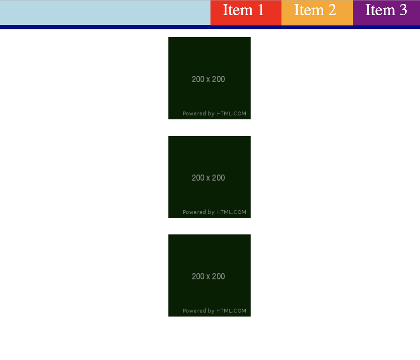

# 🐛 Images and Navigation Bar Items are Not Displaying Correctly

Work with a partner to resolve the following issue(s):

* Users should be able to see a horizontal navigation bar.

* Users should be able to see three images.

* Users should be able to see one image on each line.

## Expected Behavior

* All list items in the navigation bar should display inline.

* All images should be visible. 

* Each image should appear centered and on its own line.

## Actual Behavior

* Each list item in the navigation bar displays on its own line.

* Two images are visible and one is not displayed.

* The two visible images display inline. 

## Assets

The following image demonstrates the web application's appearance and functionality:

---

## 💡 Hints

What display property is used to hide an element? 

## 🏆 Bonus

If you have completed this activity, work through the following challenge with your partner to further your knowledge:

* What is the CSS visibility property? How is it different from the display property?

Use [Google](https://www.google.com) or another search engine to research this.

---
@2020 Trilogy Education Services, LLC, a 2U, Inc. brand. Confidential and Proprietary. All Rights Reserved.
