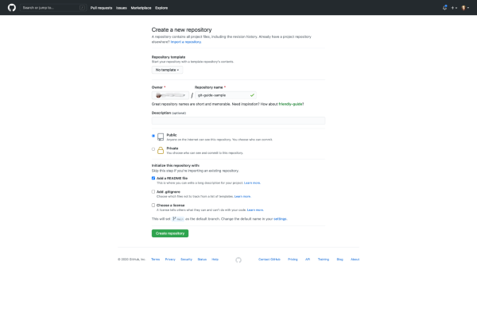

# Setting Up a Repository with Git 

In this activity, we will walk through setting up a repository using terminal commands and Git version control.

Git allows developers to track and store versions of content as well as collaborate with others. For each class, we use Git to share code using a class repository. In addition, for each homework assignment, you will be required to provide a URL link to your GitHub repository containing your code.

This activity will review the terminal commands `mkdir`, `touch`, `cd`, `ls`, `pwd`.

You will also gain familiarity in the use of the Git commands `config`, `clone`, `add`, `commit`, `push`, `pull`, and `status`.

These commands are essential tools that you will use to down the activities prior to each class, clone an existing repo, and create a new repo to store your code and share with others, including your homework. 

## Instructions

### Configure Local Git Default Branch to Main

**If you have previously configured Git, you do not need to repeat this step!**

* GitHub changed the default branch from `master` to `main`. To stay in sync with GitHub, you need to change our local Git configuration to use `main` as the default branch.

* If you are using **macOS**, you must have Git version 2.28 or later installed.

* To check the version you have installed, enter this command in the terminal:

  ```bash
  git --version
  ```

* To update Git, **Mac users** can enter the following Homebrew command: (Note: Window users do not need to do this!)

  ```bash
  brew install git
  ```

* To set the default branch to `main`, both **Windows and Mac users** run the following command in the terminal:

  ```bash
  git config --global init.defaultBranch main
  ```

* You will not get a confirmation message. If the configuration is successful, it will simply return back to the command-line prompt.

### Configure User Name and Password 

* To get the most out of Git, you can use `git config` to set your user name and password locally.

* You can use `git config` to set your user name globally with the following command:

  ```bash
  git config --global user.name "<Your-Full-Name>"
  ```

* You can use `git config` to set your email globally with the following command:

  ```bash
  git config --global user.email "<your-email-address>"
  ```

* You can check your current Git configurations using `--list`:

  ```bash
  git config --list
  ```

### Create and Clone a Repository

* Navigate to [GitHub](https://github.com/) and create a new repository by clicking on the green `new` button at the top left and entering `git-guide-sample` in the `Repository Name` box.  

* Select the "Add a README file" checkbox. The page should look something like the following image:

  

* To prepare to clone the newly created repository to the local machine by clicking the green `Code` button and selecting the HTTPS option. Then, copy the value provided, as the following image shows:

  

* Navigate to the Desktop directory in your terminal using the `cd` terminal command. 

  ```bash
  cd Desktop
  ```
* To clone the repo, use the `git clone` command followed by the value copied from Github. 

  ```bash
  git clone <url>
  ```

* Once it's done cloning to your machine, navigate to the cloned repository's directory using the `cd` command.

  ```bash
  cd git-guide-sample
  ```

### Add a New File to the Project 

* Let's add an `index.html` file to our project.

* To check the working directory, use `pwd` to print the working directory. 

  ```bash
  pwd
  ```

* If you are not already in the `git-guide-sample` directory, use `cd` to navigate to the project folder.

* Inside the project directory, use `touch` to create a new file.

  ```bash
  touch index.html
  ```

* To list the contents of the project directory, use `ls`. A `README.md` and the newly created `index.html` should appear. 

  ```bash
  ls
  ```

### Add a New Directory to the Project

*  Let's add an `assets` directory to our project. Inside that directory, we will put our `style.css` file.

* Inside the `git-guide-sample` directory, use `mkdir` to create a new directory named `assets`

  ```bash
  mkdir assets
  ```

*  Use `cd` to navigate to the newly created `assets` directory.

  ```bash
  cd assets
  ```

* Use `touch` to create a `style.css` file.

  ```bash
  touch style.css
  ```

* Navigate back to the project folder using `cd ..`

  ```bash
  cd ..
  ```
* Use `ls` to list the contents of the project directory. The assets directory should appear on the list.

### Commit Changes in Git

* Let's commit the changes made to the `git-guide-sample` directory to Git.

* To commit a change, we first have to stage it. The `git add` command adds changes to the staging area so they can be committed. We use `git add .` to stage all the changes we made since the last commit.

  ```bash
  git add .
  ```
* To see the changes to be committed, we use `git status`

  ```bash
  git status
  ```
* To commit the changes, we use `git commit` and add a commit message. A good commit message should describe the changes made.

  ```bash
  git commit -m "Add index.html and style.css files"
  ```
* You will receive a message indicating the number of files changed similar to the message below indicating that the changes have been committed locally.

  

### Pushing Changes to the Remote Repo

Let's push the changes to the remote repository on GitHub.

* Use `git push` to upload the changes to our remote repository. The `origin` means that we want the changes pushed to the repo we cloned above. We use `main` because we are working on the `main` branch.

  ```bash
  git push origin main
  ```

* If successful, you will receive a message similar to the message below:

  

* The remote repo on GitHub should also be updated.

  
  
### Update the Local Readme File

* Let's update the project's `README.md` file. Go ahead and open it in your VS Code editor. You should see something like this image with some slight differences depending on your VS Code configuration:

  

* As of right now, there should just be the name of the repository listed using `#`, which is the markdown equivalent of an HTML `<h1>` element. Let's add some more to this file so there's a change to be tracked by Git. Add the following markdown text to the `README.md` file below what's already there:

  ```md
  ## This is a subheading created locally

  All of this content added to the readme file has been added from my local Git repository.
  ```

* The result should look like the following image in VS Code:

  

* Great! Now let's save this work and make a similar update to the readme file through the browser using GitHub.

### Update the Remote Readme File on GitHub

* Now that we've updated the codebase locally by adding to our `README.md` file, let's update that file in a different on GitHub as well. This will force the local repository and the GitHub remote of the repository to have conflicting file histories that we'll have to address soon.

* Navigate to the GitHub repository in your browser, and you'll notice that in the section that displays your `README.md` content, there's a little pencil icon in the upper right corner that will allow you to edit the file directly from GitHub upon click. If you're having trouble locating it, compare your screen to the following image:

  

* Once we enter this edit mode, we can add whatever we need to the `README.md` file, so let's add the following below the content that's already there:

  ```md
  ## This is a subheading created on GitHub

  All of this content added to the readme file has been added from my remote GitHub repository.
  ```

* Notice how the text content is slightly different from what we added locally through VS Code? This will help us differentiate which content came from where when we see our eventual merge conflict.

* Let's commit this change to the GitHub repository, move a bit lower down the page and leave a commit title such as `Updated README.md on GitHub`, and press the Commit Changes button. The page should look like the following image before we press the button:

  

* Upon completion, you'll be brought back to the `README.md` file's view in GitHub so that you can see your updated file.

* Now that we've successfully created two different Git timelines for the `README.md` file, let's try and get them back in sync with on another.

### Create Merge Conflict

* Navigate back to your local Git repository in VS Code and check that the file is saved.

* Once the file is saved, we want to use `git add`  and `git commit` commands from the command-line track and save the local work. If we didn't, we wouldn't be allowed to pull the updated content from GitHub into the local repository, because we haven't committed the changed files. From the repository's location in the command line, enter the following commands:

  ```bash
  # instruct all changed files in this repo to be tracked by git
  git add -A
  # commit our changed files with a message of what has been done
  git commit -m "Updated README.md locally"
  ```

* Once the local work is saved and committed, we now want to attempt to resync the local repo and GitHub repo using the `git pull` command. Remember, the `git pull` command is the command we use when we want to take any updated content from the GitHub repository (known as the remote) and have it applied to the local code. Run the following command from the command line:

  ```bash
  # retrieve all changed content from the `main` branch in our GitHub remote
  git pull origin main
  ```


* To recap what happened here, we purposely created a diverging timeline for the content in the `README.md` file. When we attempted to sync the two, Git didn't know which one was correct, so it prompted us that there was a conflict and we must resolve it. Upon resolution, we committed and pushed the code and could move on with our work.

* As it's been said, merge conflicts come with the territory of using version control and working with others on an application. Despite the negative term "conflict," it's actually a good thing that Git warns us and prompts us to do something about it, because it would be a bad situation if Git just automatically merged everything together or overwrote content we didn't want to use anymore.

* The most important thing to take away from handling merge conflicts is that you will get through it with patience. Take a minute to diagnose where things went wrong and decide how you want to handle it. It will also help to identify any problems with your overall workflow if you continuously run into merge conflicts, as it means there is poor communication and organization among you and your team.

### Hints

* Ask an instructor or TA if you get stuck or have any questions!

* Check the [Atlassian guide on setting up a repository](https://www.atlassian.com/git/tutorials/setting-up-a-repository) for reference.

---
© 2020 Trilogy Education Services, LLC, a 2U, Inc. brand. Confidential and Proprietary. All Rights Reserved.