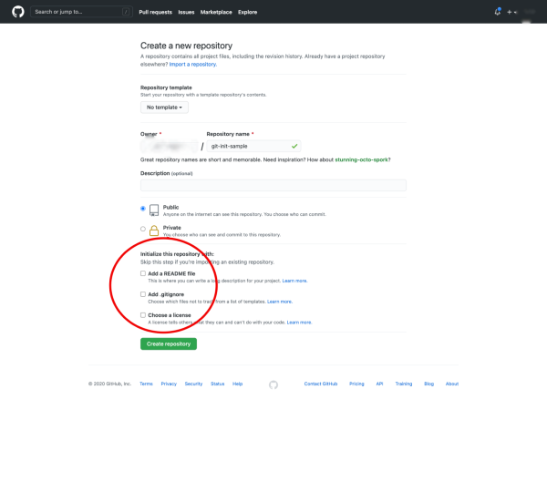
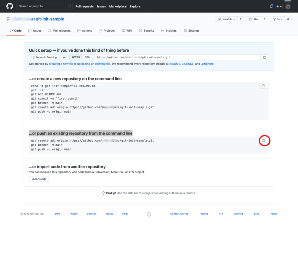
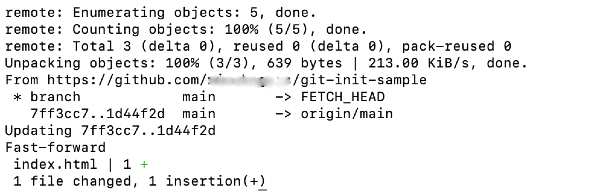

# Setting Up a Repository with Git 

In this activity, we will walk through setting up a repository using terminal commands and Git version control.

Git is an important tool that allows developers to track and store versions of content.

Git is also an important way to collaborate and share code with others. For the duration of this Bootcamp, we will use Git to share code using a class repository which you will be required to download prior to each class. In addition, for each homework assignment, you will provide a URL link to your GitHub repository containing your code for the grading team. 

This activity will review the terminal commands `mkdir`, `touch`, `cd`, `ls`, `pwd`.

You will also gain familiarity in the use of the Git commands `config`, `clone`, `add`, `commit`, `push`, `pull`, and `status`.

These commands are essential tools that you will use to create a repository, initialize version control on your projects, commit changes to a repository, and pull from a remote repo. 

## Instructions

### Configure Local Git Default Branch to Main

* Let's set the local Git default branch to `main`.

* **Important:** If you have previously configured Git, you do not need to repeat this step!

* GitHub changed the default branch from `master` to `main`. To stay in sync with GitHub, you need to change our local Git configuration to use `main` as the default branch.

* If you are using **macOS**, you must have Git version 2.28 or later installed.

* To check the version you have installed, enter this command in the terminal:

  ```bash
  git --version
  ```

* To update Git, **Mac users** can enter the following Homebrew command: (Note: Window users do not need to do this!)

  ```bash
  brew install git
  ```

* To set the default branch to `main`, both **Windows and Mac users** run the following command in the terminal:

  ```bash
  git config --global init.defaultBranch main
  ```

* You will not get a confirmation message. If the configuration is successful, it will simply return back to the command-line prompt.

### Initialize a New Version-Controlled Project

* We already learned how to create a remote repository on GitHub in our first class. So now, let's initialize a new version-controlled project locally using `git init`.

* Using `git init`is an alternative way to create a repo and the results are similar to using `git clone`. However, unlike `git clone`, we start by creating a repo locally via the command line first. 

* Using `git init`also allows us to turn an existing project into a Git repository easily.

* Start by creating a new project directory named `git-init-sample`.

* Use `cd` to navigate to the Desktop directory and `mkdir` to create a new directory called `git-init-sample`.

  ```bash
  cd Desktop
  mkdir git-init-sample
  ```

* Next, use `cd` to navigate into our new directory and add an `index.html` file using `touch`.

  ```bash
  cd git-init-sample
  touch index.html
  ```

* To initialize version control, use `git init`.

  ```bash
  git init
  ```

* If successful, a message reading `Initialized empty Git repository in /Users/<your-user-name>/Desktop/git-init-sample/.git/` should appear.

* Using `git init` adds version control locally to a project, allowing us to track and save changes. It doesn't not create a remote repository.

* To create a remote repository to store your code, navigate to [GitHub](https://github.com/) and create a new repository by clicking on the green `new` button at the top left and entering `git-init-sample` in the `Repository Name` box. This is the same as we did above!

* **Important** Since we are importing an existing repository, do not click any of the checkboxes. The page should look something like the following image:

 

* Click on `Create Repository`. Then copy the code under the header `"…or push an existing repository from the command line"` using the copy icon. The page should look something like this:

  
  
* Paste the commands into the terminal and click `enter`.

* If successful, you should see a message similar to the one below:

  

### Pull Changes from the Remote Repository

* Let's download changes from a remote repository using `git pull`.

* Prior to each class, it is important that you do a `git pull` to download any changes and activity files from the student repo to your local machine.

* To perform a git pull, first navigate to the project directory using `cd`.

  ```bash
  cd git-init-sample
  ```

* Next, use `git pull` to pull down the changes from the remote. Just like when we did a `git push`, we use `origin` to represent the original directory -- or more precisely the original repository's URL -- followed by the name of the branch. The name of our branch is `main.`

  ```bash
  git pull origin main
  ```

* Right now, our local is up-to-date with the remote. If that is the case, you will get a message reading `"Already up to date."`. This means no changes were made to your local.

* If the remote has changes that you do not have locally, you will get a message that lists the changes made similar to the one below:

  

* Both messages indicate that the `git pull` command has been successfully performed.

* The changes made, if any, can be viewed by opening the project directory in VS Code.

### Share Remote Repo URL 

* Let's share the URL for the remote repository.

* For each homework, you will be required to share the URL of your repository. To share the URL, navigate to the repository on GitHub. The page should look something like the following image:

  
  
* Copy the URL and share it with your partner in Slack. To view your partner's repo, simply click on the shared link. 

### Hints

* Ask an instructor or TA if you get stuck or have any questions!

* Check the [Atlassian guide on setting up a repository](https://www.atlassian.com/git/tutorials/setting-up-a-repository) for additional information about setting up a repository using `git clone` or `git init`.

* Check the [Atlassian guide on git pull](https://www.atlassian.com/git/tutorials/setting-up-a-repository/git-config) for additional information about syncing your repos and using `git pull`.

---
© 2021 Trilogy Education Services, LLC, a 2U, Inc. brand. Confidential and Proprietary. All Rights Reserved.
