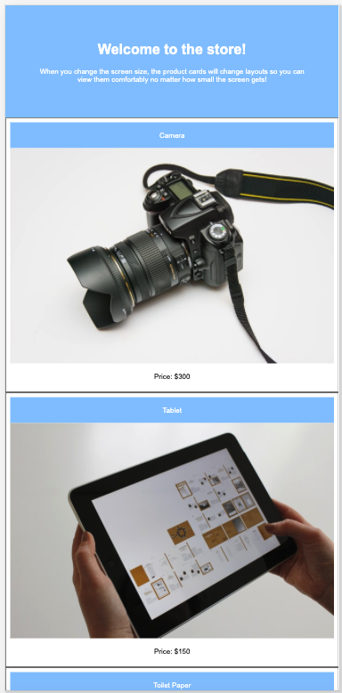

# Media Queries for Screen

In this activity, you will work with a partner to implement basic media queries for screen.

## Instructions

* Be sure to work with your partner!

* Open [index.html](./Unsolved/index.html) in the browser and make the screen size smaller. Notice what happens to the products on the page.

* As an online shopper, I want to view products clearly on my mobile phone as well as my computer.

* Open [style.css](./Unsolved/assets/css/style.css) to examine the code and implement the following features:

  * When the screen size is larger than 992 px, the product cards on the screen are side-by-side.

  * But when I change the screen size to 992 px or smaller, the product cards on the screen should split into two columns.

  

  * When I change the screen size to 768 px or smaller, the product cards on the screen should be stacked on top of each other.

  

* Optional: Just for fun, change the background color of the header each time the product cards change layout. 

## 💡 Hint(s)

* What is the media feature we use to check for the maximum width of the display area?

## 🏆 Bonus

* If you have fully completed the above tasks, here is something you and your partner can work through as an added challenge to further your knowledge:

  * What is mobile-first design?

* Use [Google](https://www.google.com) or another search engine to research the above.
