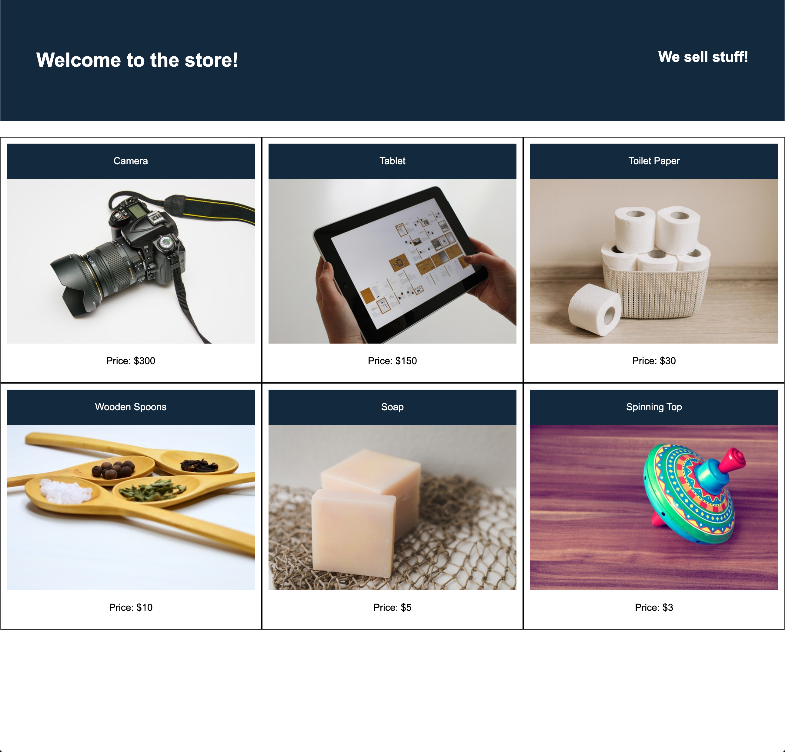

# 🐛 Product Cards Run Off the Page

Work with a partner to resolve the following issue:

* As a user, I want to view all products in two or more rows.

* As a user, I don't want to scroll horizontally to see additional products.

## Expected Behavior

Product cards that don't fit within the first row should display on the next row.

## Actual Behavior

Product cards run off the page in a single row.

## Assets

The following image demonstrates the web application's appearance:

---

## 💡 Hint(s)

* What additional flexbox properties could help direct the behavior of child elements?

## 🏆 Bonus

* If you have fully completed the above tasks, here is something you and your partner can work through as an added challenge to further your knowledge:

  * By default, flexbox runs in rows, left to right. In what other directions could it run?

* Use [Google](https://www.google.com) or another search engine to research the above.
