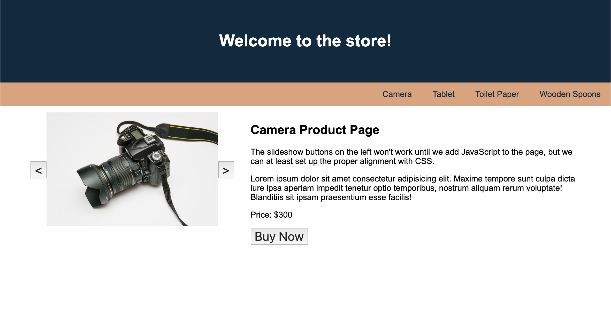

# Fix the Flexbox Components

In this activity, you will work with a partner to debug some broken code to properly position elements with flexbox justification and alignment.

## Instructions

* Be sure to work with your partner!

* Open [index.html](./Unsolved/index.html) in the browser and examine the different components on the page. Note that they currently do not meet the following requirements:

  * As a user, I want the navigation buttons to be on the right side

  * As a user, I want the slideshow buttons to be normal sized and centered alongside the image

* To meet these requirements, the page should look like the following image:

  

* Using the following questions, try to debug and fix the code:
  
  * What do the DevTools reveal about the navigation and slideshow components?
  
  * What CSS rules in [style.css](./Unsolved/assets/css/style.css) are affecting these components?
  
  * What is a good key word or phrase you can Google to find resources to help you debug?

## 💡 Hint(s)

* Look up the other possible values for flexbox's alignment and justification properties.

## 🏆 Bonus

* If you have fully completed the above tasks, here is something you and your partner can work through as an added challenge to further your knowledge:

  * What e-commerce websites can you find that are using flexbox properties to help organize their components and layouts?

* Use [Google](https://www.google.com) or another search engine to research the above.
