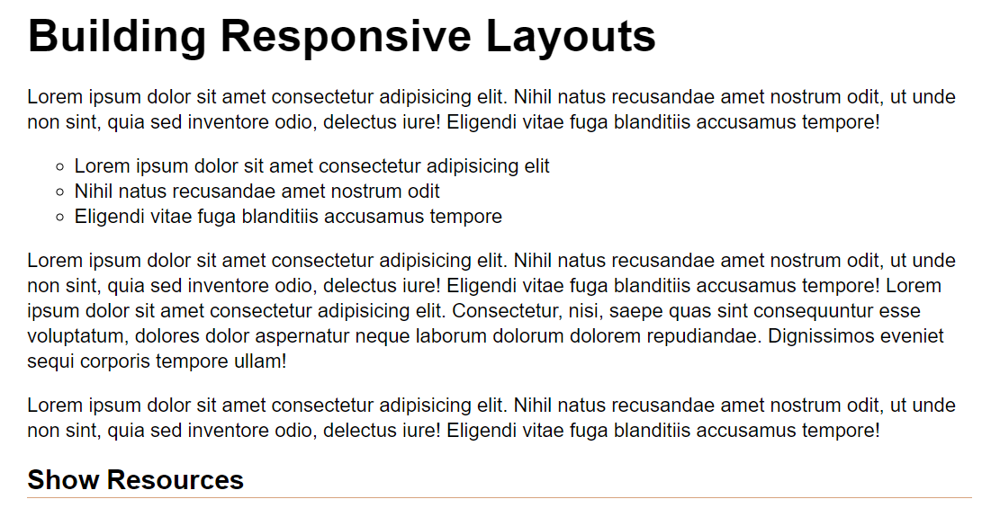
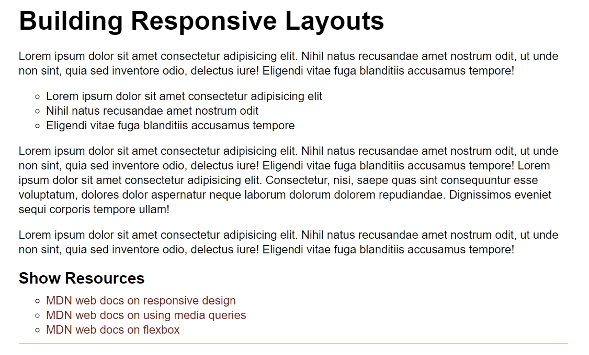

# Pseudo-Classes

In this activity, you will work with a partner to apply pseudo-classes to elements to enhance the UI.

## Instructions

* Be sure to work with your partner!

* Open [index.html](./Unsolved/index.html) in the browser and examine the page.

* Open [style.css](./Unsolved/assets/css/style.css) to examine the CSS code.

* Using HTML and CSS, implement the following features:

  * As a user, I want additional resource links at the bottom of the article.

  * When the page loads, the resource links should initially be hidden.

  * When I move the mouse over the text "Show Resources," the resource links should display.

* To meet these requirements, the page should look like the following image by default:

  

* When the cursor is over the "Show Resources" text, the page should look like the following:

  

* You can use the following resource links for the content:

  * https://developer.mozilla.org/en-US/docs/Learn/CSS/CSS_layout/Responsive_Design

  * https://developer.mozilla.org/en-US/docs/Web/CSS/Media_Queries/Using_media_queries

  * https://developer.mozilla.org/en-US/docs/Learn/CSS/CSS_layout/Flexbox

## 💡 Hint(s)

* You will need to use the CSS `display` property.

* Look up examples of how other developers used the `:hover` pseudo-class in creative ways.

## 🏆 Bonus

* If you have fully completed the above tasks, here is something you and your partner can work through as an added challenge to further your knowledge:

  * How can you force pseudo-class styles to display using the Chrome DevTools?

* Use [Google](https://www.google.com) or another search engine to research the above.
