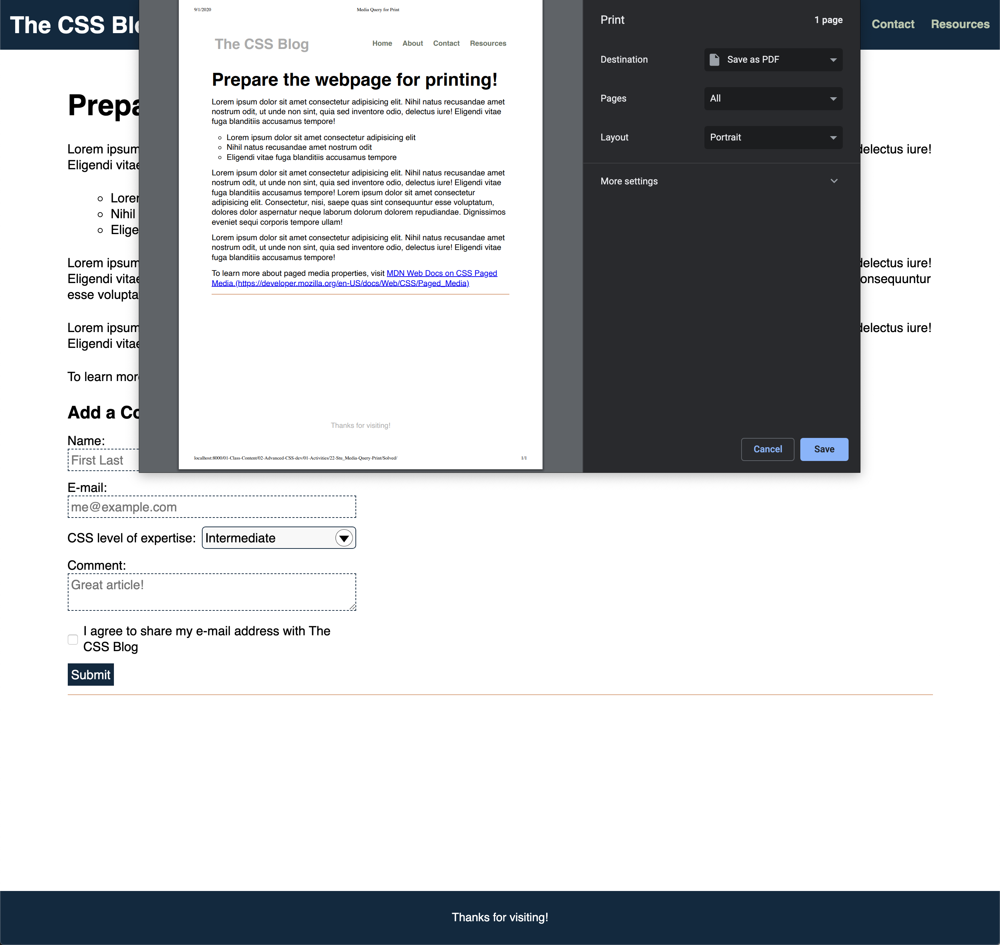

# 🏗️ Implement Media Queries for Print

Work with a partner to implement the following user story:

* As a user, I want to print from the web but exclude UI elements so that they don't clutter the page on paper.

## Acceptance Criteria

* It's done when the user prints the blog post and the form isn't included.

* It's done when the printed blog page displays the links' URLs (but not the header links' URLs).

## Assets

The following image demonstrates the web application's print preview appearance:

---

## 💡 Hints

* To print the URL on the page, how can we use the pseudo-element `::after` to take the value of the `href` attribute and display it in brackets after the link?

## 🏆 Bonus

If you have completed the activity and want to further your knowledge, work through the following challenge with your partner:

* What is a media query that can be used for accessibility?

Use [Google](https://www.google.com) or another search engine to research this.

---
© 2020 Trilogy Education Services, LLC, a 2U, Inc. brand. Confidential and Proprietary. All Rights Reserved.