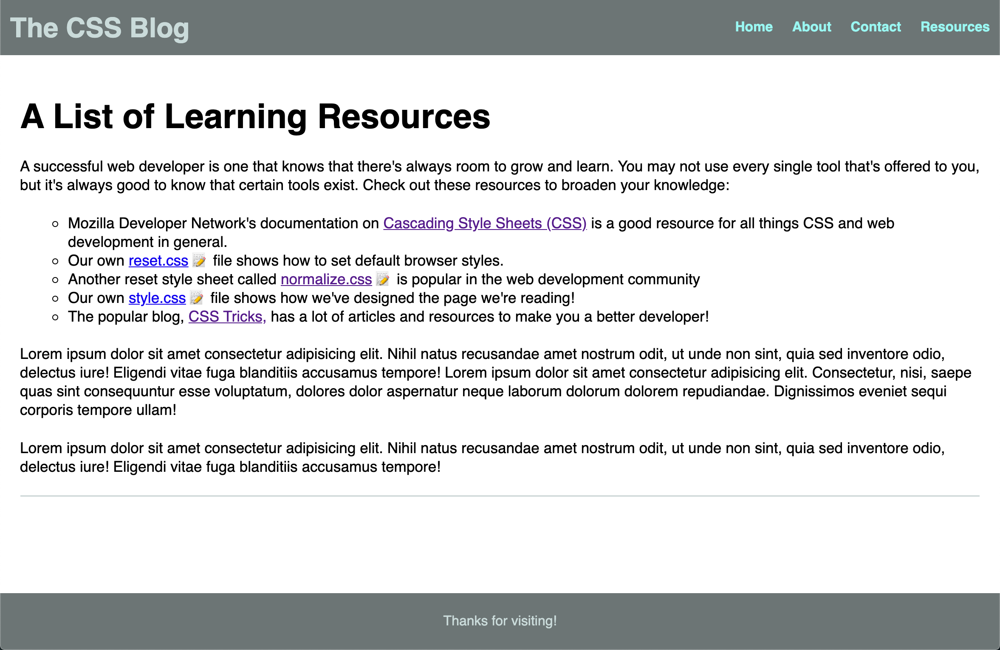

# Advanced CSS Selectors

In this activity, you will work with a partner to use the MDN web docs to implement CSS selectors beyond single classes and elements.

## Instructions

* Be sure to work with your partner!

* Navigate to the [MDN web docs on Attribute Selectors](https://developer.mozilla.org/en-US/docs/Web/CSS/Attribute_selectors) in your browser.

* Open [index.html](./Unsolved/index.html) and [style.css](./Unsolved/assets/css/style.css) in your IDE and examine the code.

* Using the documentation, implement the following:

  * As a user, I want to see an icon next to every `<a>` element that has to a downloadable CSS file in its `href` attribute.

  * As a developer, I want to use only CSS to insert this icon.

* To meet these requirements, the page should look like the following image:

  

* You can use the following emoji for the icon: 📝

## 💡 Hint(s)

* You can target a file type by its file extension (i.e. `.css`, `.html`, `.md`, etc.)

* Pseudo-elements can help you accomplish this task!

## 🏆 Bonus

* If you have fully completed the above tasks, here is something you and your partner can work through as an added challenge to further your knowledge:

  * How do selectors affect CSS performance?

* Use [Google](https://www.google.com) or another search engine to research the above.
