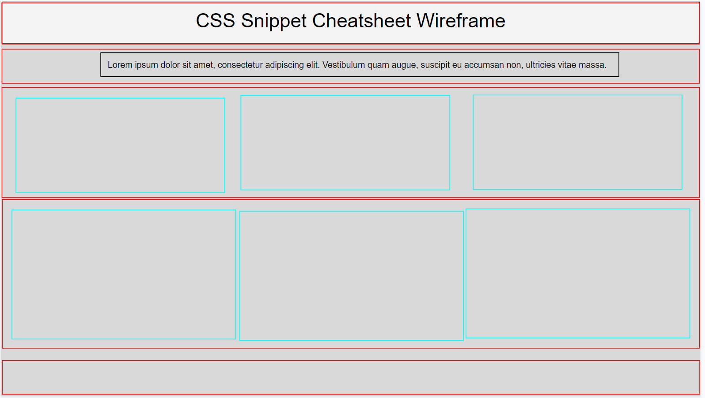

## Activity 21: Wireframing Instructor

## Getting Started:

* Open [Google Slides Wireframe Starter Kit](https://docs.google.com/presentation/d/1BFp6eR2GD8gbTuuoMq1XhkOKdBH7ozBRL1ItoQeK1BE/edit?usp=sharing) and explain the following:

    * This is the starting of a wireframe for the mini-project for this unit.

    * The area's highlighted in red represent the rows and the blue represents the columns.

TODO: 2u copyright?