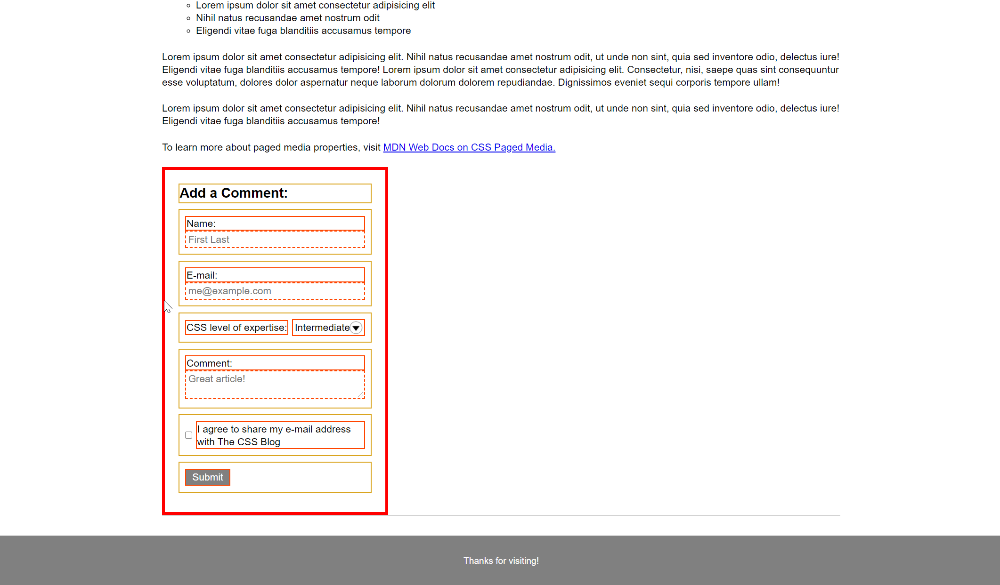

# 🏗️ Create a Wireframe of a Form

Work with a partner to implement the following user story:

* As a developer, I want to be able to see how my elements are going to be grouped together so that I can better design my website.

## Acceptance Criteria

* It is done when my form and all of the elements inside have the correct class assigned according to the surrounding elements.

* It is done when my elements have a clear distinction between parent and child elements.

* It is done when my form resembles a wireframe.

## Assets

The following image demonstrates the web application's appearance and functionality:

---

## 💡 Hints

* How do elements interact with each other when using flexbox?

* How do we add CSS styles to classes?

## 🏆 Bonus

If you have completed the activity and want to further your knowledge, work through the following challenge with your partner:

* At which stage in the development process should we use wireframes?

Use [Google](https://www.google.com) or another search engine to research this.

---
© 2020 Trilogy Education Services, LLC, a 2U, Inc. brand. Confidential and Proprietary. All Rights Reserved.