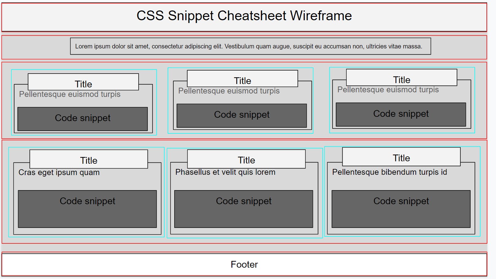

# 🏗️ Create a Wireframe

Work with a partner to implement the following user story:

* As a developer, I want to be able to see how my elements are going to be grouped together so that I can better design my website.

## Acceptance Criteria

* It is done when I have created a wireframe that has the correct elements grouped based on the columns and rows using Google slides.

* It is done when I have completed the wireframe of the CSS snippet cheat sheet mini-project.

## Assets

The following image demonstrates the web application's appearance and functionality:

Open [Google Slides](https://docs.google.com/presentation/u/0/?tgif=d) and create elements using the tools highlighted in the image below:

---

## 💡 Hints

* How do elements interact with each other when using flexbox?

## 🏆 Bonus

If you have completed the activity and want to further your knowledge, work through the following challenge with your partner:

* How might our wireframe look on a mobile devices?

Use [Google](https://www.google.com) or another search engine to research this.

---
© 2020 Trilogy Education Services, LLC, a 2U, Inc. brand. Confidential and Proprietary. All Rights Reserved.