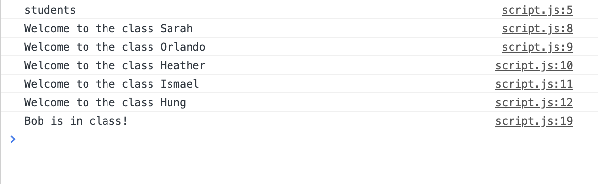

# 🏗️Log Messages to Console Using an Array

Work with a partner to implement the following user story:

* As an instructor, I want to create a group of my students' names and use the data from that group to welcome each of my students to class. I also want to remove a student who has left the class and replace the name with a new student.

## Acceptance Criteria 

* Be sure to work with your partner!

* Open [script.js](12-Stu_Arrays/Unsolved/script.js) to implement the following features:

  * It is done when I log the length of the `students` array holding the class members' names, the number `5` is logged.

  * It is done when I log a welcome message in the console, the data in the array is used to welcome each student with the message: "Welcome to the class STUDENT_NAME".

  * It is done when the first student in the array is removed from the class, the student name is replaced with the name `Bob`.

  * It is done when I test if `Bob` has replaced the first student in the array, if `Bob` has replaced the first name, the message "Bob is in class" logs to the console.  Else, if Bob is not the first name in the array, the message "STUDENT_NAME is still in class" is logged. 

## Assets

## 💡 Hints

Don't forget that arrays are zero-indexed! That means the first index is 0, not 1. 

## 🏆 Bonus

* If you have fully completed the above tasks, here is something you and your partner can work through as an added challenge to further your knowledge:

  * How could you use the array's length property to access the last element in an array of any length?

* Use [Google](https://www.google.com) or another search engine to research the above.
