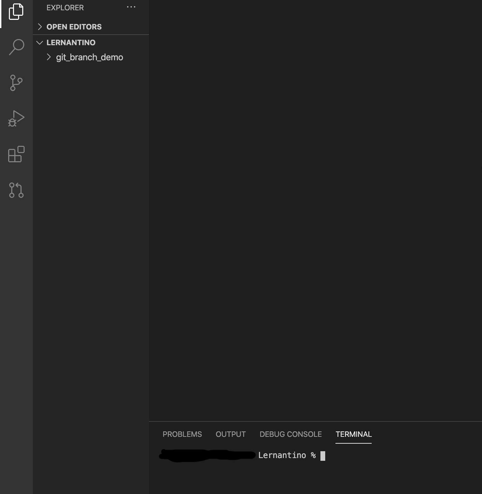
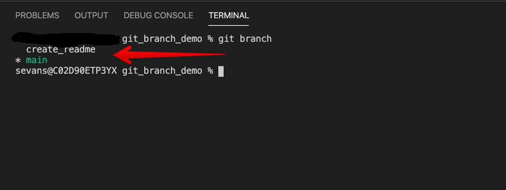
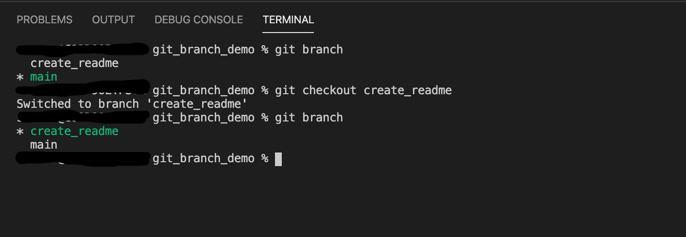
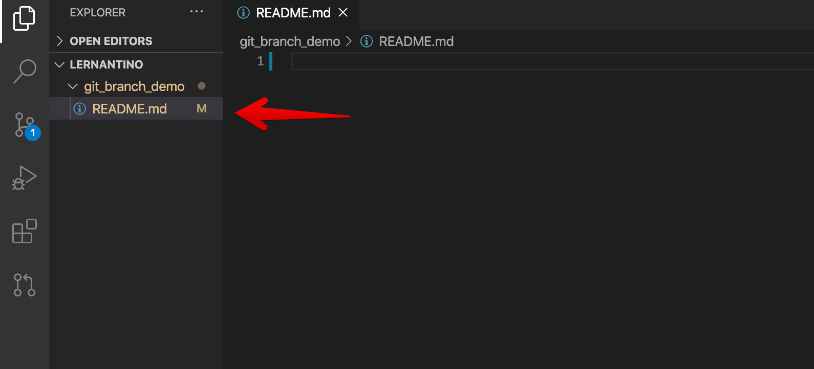
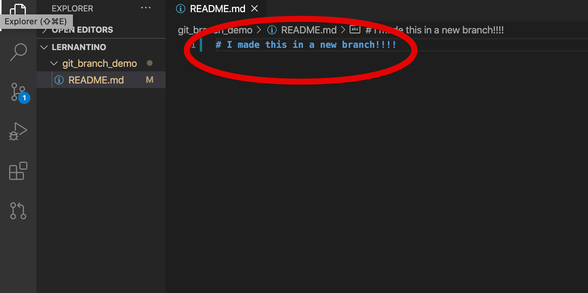
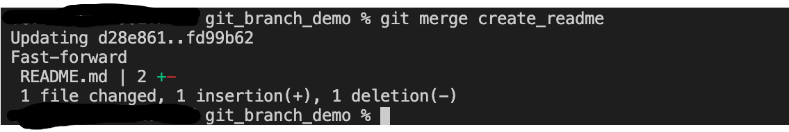
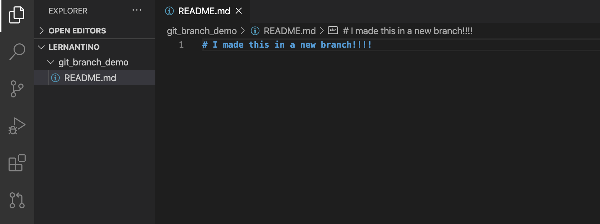
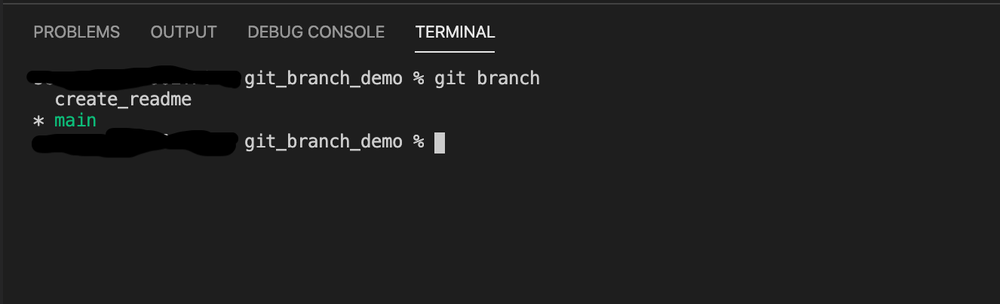

# Git Branch

Branching is one of the most powerful and useful tools that git has to offer and will likely be a part of the everyday development process in your career as a developer. Whenever you need to fix a bug or build a new feature, you will create a new branch to make your changes.

A few of the many advantages of creating branches for specific features include that it allows developers to create and make changes to individual features in an isolated environment, to easily merge code once a feature is complete, and to avoid merging unstable code into your main code base. 

In this activity, we will use git commands to create a new branch, complete a feature in the new branch, merge the branch with main, and close the branch. 

## Instructions

### Create a new directory and repository

* Navigate to a directory where you usually store your coding files using your command line.

* Create a new directory called `git_branch_demo`:

  ```bash
  mkdir git_branch_demo
  ```

* `cd` into the newly created directory and initialize an empty git repo in the directory:

  ```bash
  cd git_branch_demo
  git init .
  ```
  
* Open the `git_branch_demo` directory in your IDE. You should see the empty `git_branch_demo` directory on the left. Next, we will create a new branch to add a new feature.



### Create a new branch

* The git command for creating a new branch in your repo is `git branch <branch name>`. It is helpful to pick a name that is associated with the feature that you will be working on. In our case, we will be creating a README.md file, so we will call it `create_readme`:

```bash
git branch create_readme
```

### Switch to the new branch

* The git command `git branch` allows us to see a list of existing branches. Run the following in your terminal so that we can confirm that the `create_readme` branch was created.

```bash
git branch
```

* You should see the `create_readme` branch and a `*` next to `main`. That tells us that we are still on the main branch.




* In order to switch branches, we type `git checkout create_readme` followed by the `git branch` command to confirm that we've switched branches. 

```bash
git checkout create_readme
git branch
```

* You should now see a `*` by `create_readme`.




* You can also create a branch and switch over to it at the same time with the following command:

```bash
  git checkout -b <branch-name>
```

### Complete feature while on branch

* Now that we are on the correct feature branch, we need to work on the feature. Create a README.md file in the `git_branch_demo` directory.




* Add some text to the README.md file.




* Finally, add and commit the changes that you made.

 ```bash
  git add .
  git commit -m "Created README.md and added text to the file"
  ```

### Merge the branch

* Now that the feature is complete, we can merge the feature branch with `main`. First, we need to switch back to `main` from `create_readme`. Remember, it's always a good idea to confirm that you are on the correct branch using the `git branch` command.

```bash
git checkout main
git branch
```
* Once we are on main, you'll notice that we no longer have a README.md file in the directory. That's because `main` is currently behind `create_readme`. Add the following code to your terminal:

```bash
git merge create_readme
```

* If the merge is successful, you should see something similar to the following in your terminal.




* Now, your directory should include the README.md file that we created along with whatever text you added to the file.



### Delete the branch

* We are all done with our feature, but if you type the `git branch` command into your terminal, you'll see that `create_readme` still exists.



* Since we are finished with this feature, we can delete the branch by typing the following:

```bash
git branch -d create_readme
```

* Run `git branch` again and you should see something similar to the following:


### Hints

* When naming a branch, always include a reference to the feature that you will be working on in the branch. Try to be descriptive but concise. Stay away from including your own name in the branch name.
    * Do:   `git branch user_login_page`
    * Don't:   `git branch rachels_feature`


---

© 2020 Trilogy Education Services, LLC, a 2U, Inc. brand. Confidential and Proprietary. All Rights Reserved.