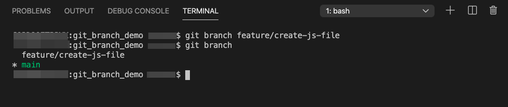
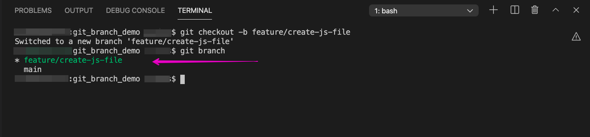
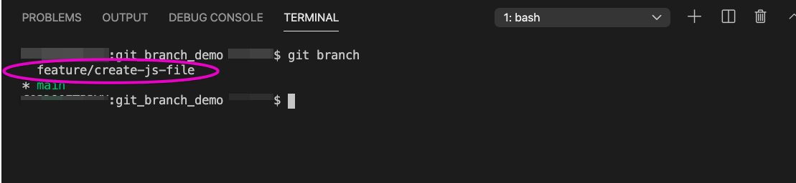

# Git Branch

Every developer has done it&mdash;you make a mistake but fail to notice it until you've already written a lot of great code in the meantime. If you want to revert your changes to fix the error, you risk losing all that work!

Luckily, a powerful tool called **Git branching** helps prevent scenarios like this and makes it easier to fix problems when they do arise. Branching allows team members to work on separate features at the same time while minimizing conflicts. For instance, you can easily switch to a colleague's branch to help them with their code or ask colleagues to review your own code before merging it with the main codebase.

You'll likely use branching every day in your development career. Whenever you need to fix a bug or build a new feature, you'll create a new branch&mdash;an isolated environment where you can write and test code without messing up the main codebase. This way, you always have the option to return to an earlier version without losing everything. Once the work is complete, you can merge the branch with the main codebase and move on! 

In this activity, we'll learn the concept of branching by using Git commands to create a new branch, complete a feature in the new branch, merge the branch with `main`, and close the branch when finished. 

## Instructions

* Navigate to a directory where you usually store your coding files using your command line.

* Create a new directory called `git_branch_demo`. We could create a new repo in Github as well, but because we're working locally for this activity, we can skip that step and instead issue the following command:

  ```bash
  mkdir git_branch_demo
  ```

* Now use the `cd` command to navigate into the newly created directory. Initialize an empty Git repo in the directory with the following command:

  ```bash
  cd git_branch_demo
  git init .
  ```
  
* Open the `git_branch_demo` directory in VS Code.

* Now that we're ready to create the first feature, we need to create a new branch. Remember, the goal is to avoid working in the `main` branch, so that we can make mistakes on the new feature without damaging code that already works.

* The Git command for creating a new branch in your repo is `git branch feature/<feature-name>`. Pick a name that is associated with the feature that you will be working on. `feature/` reminds us that each branch is dedicated to a specific feature, while `<feature-name>` is the name of the feature. In this case, we'll be creating a README.md file, so let's call it `create-readme`, as follows:

  ```bash
  git branch feature/create-readme
  ```

* The Git command `git branch` allows us to see a list of existing branches. Run the following command so that we can confirm that the `feature/create-readme` branch was created:

  ```bash
  git branch
  ```

* You should see the `feature/create-readme` branch and a `*` next to `main`, as shown in the following image:

  

  That `*` tells us that we are still on the main branch. If the repo includes a long list of branches, we might need to press the `q` key to exit the list.

* We've created a branch, but we're still in `main`. How do we get into the branch we just created? We can type `git checkout feature/create-readme` to switch from `main` to the new branch, then type the `git branch` command to confirm that we've switched branches. See the following code for an example:

  ```bash
  git checkout feature/create-readme
  git branch
  ```

* We should now see a `*` by `feature/create-readme`, as shown in the following image:

  

  > **Important:** We also have the option to create a branch and switch over to it at the same time by entering `git checkout -b <branch-name>`.

* Now that we're on the correct feature branch, we need to work on the feature. Create a README.md file in the `git_branch_demo` directory, as shown in the following image:

  

* Add some text to the README.md file, so that it looks something like the following image:

  [We build the new feature by adding the text, "I made this in a new branch!!!!" to the README.md file.](./Images/04-text.png)
  <!-- Missing image here -->

* Finally, add and commit the changes that you made, as follows:

  ```bash
    git add .
    git commit -m "Created README.md and added text to the file"
    ```

* Now that the feature is complete, you can merge the feature branch with `main`. First you need to switch back to `main` from `feature/create-readme`. Remember, it's always a good idea to confirm that you're on the correct branch using the `git branch` command. See the following example:

  ```bash
  git checkout main
  git branch
  ```

  > **Important:** Git won't let you switch to a different branch until you have added, committed, and pushed any changes that you made to your feature branch. If you try to switch without pushing your code, Git will send you a reminder to push the changes that you made before switching branches.

* Once we're in `main`, notice that we no longer have a README.md file in the directory. What happened? `main` is currently behind `feature/create-readme` and we still need to merge the feature branch with the main codebase. To merge, add the following code to the command line:

  ```bash
  git merge feature/create-readme
  ```

* If the merge is successful, we should see something similar to the following image:

  

* Now the directory should include the README.md file that we created, along with whatever text we added to the file. We asked Git to merge the code that we wrote in the feature branch with the code that already existed in `main`. At this point, the new feature is a part of the main codebase, as you can see in the following image:

  

* We're all done with the feature, and the code that we wrote safely exists in `main`. But if you enter the `git branch` command, you'll see that `feature/create-readme` still exists, as shown in the following image:

  

* We could potentially generate a huge list of feature branches while working on a large project. So to avoid confusion and stay organized, it is good practice to close a branch once a feature is completed and merged. Because we're finished with this feature and the code is now included in `main`, we no longer need the isolated environment of that branch. We can always open another branch to fix future problems. But for now, we can safely close the feature branch by issuing the following command:

  ```bash
  git branch -d feature/create-readme
  ```

* When we run `git branch`, we should see something similar to the following image:

  

* Congratulations, you've now completed your first branch lifecycle! You created an isolated environment on a new branch so that you could write and test code for a new feature, a README.md file. Once you finished adding text to README.md, you merged the feature branch with the main codebase on `main`. You then closed the feature branch, because you no longer needed to work on the README.md file. 

### Hints

* You'll come up with your own naming conventions for branches when you're working on your own project. Try to be descriptive but concise to help other developers (or your future self) understand what is happening in each branch. 

* Popular naming conventions in the field include `feature/<feature-name>`, `issue/<issue-reference>`, etc. So it is a good idea to practice these conventions while you're learning. 

* Avoid including your own name in the branch name, because multiple developers might end up working in the same branch. So, for example, instead of `git branch rachels-feature`, try using `git branch user-login-page`.

* More information can be found in these [Atlassian tutorials on branching](https://www.atlassian.com/git/tutorials/using-branches).

---

© 2020 Trilogy Education Services, LLC, a 2U, Inc. brand. Confidential and Proprietary. All Rights Reserved.
