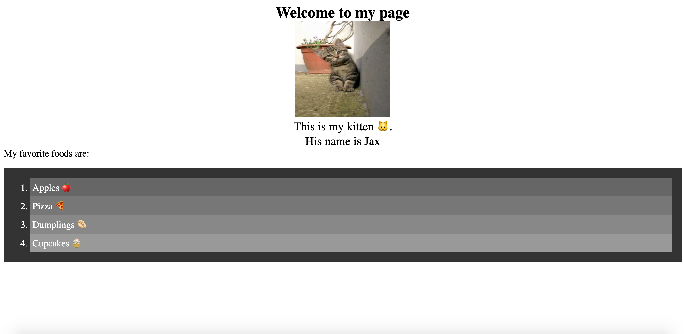

# 🏗️ Create an Ordered List Using JavaScript

Work with a partner to implement the following user story:

* As a blogger, I want to use JavaScript to create an ordered list of my favorite foods on my webpage.

## Acceptance Criteria

* It's done when an ordered list containing four favorite foods is visible in the HTML below the text `"My favorite foods are: "`.

* It's done when the ordered list has a background color of `#333333` and padding of `20px`.

* It's done when each list item has a font color of `white`, padding of `5px` and `margin-left` of `35px`.

* It's done when the first list item has a background color of `#666666`.

* It's done when the second list item has a background color of `#777777`.

* It's done when the third list item has a background color of `#888888`.

* It's done when the fourth list item has a background color of `#999999`.

## Assets

The following image demonstrates the web application's appearance and functionality:

---

## 💡 Hints

The ordered list is the last child of what element? 

## 🏆 Bonus

If you have completed this activity, work through the following challenge with your partner to further your knowledge:

What is the difference between append() and appendChild()? 

Use [Google](https://www.google.com) or another search engine to research this.

---
2020 Trilogy Education Services, LLC, a 2U, Inc. brand. Confidential and Proprietary. All Rights Reserved.
