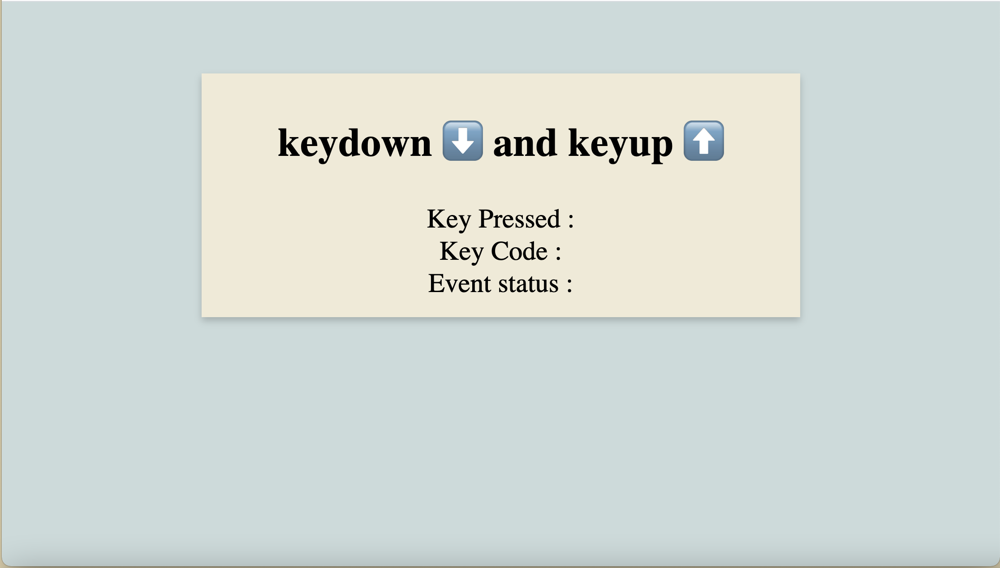

# 📖 Implement Keyboard Events to Display Value and Code of Pressed Key

Work with a partner to implement the following user story:

* As a developer, I want to display the value and code of a pressed key.

## Acceptance Criteria

* It's done when a key is pressed down, and the value of the key and the key's code is displayed. `KEYDOWN Event` should also be displayed to indicate the type of event. 

* It's done the key is released, `KEYUP Event` is displayed

## 📝 Notes

Refer to the documentation: 

[MDN Web Docs on Element: keyup event](https://developer.mozilla.org/en-US/docs/Web/API/Element/keyup_event)

## Assets

The following image demonstrates the web application's appearance and functionality:

---

## 💡 Hints

What properties can we use to access the value of the pressed key and the key's code?

## 🏆 Bonus

If you have completed this activity, work through the following challenge with your partner to further your knowledge:

* What other properties can you access using the KeyboardEvent Object? 

Use [Google](https://www.google.com) or another search engine to research this.

---
2020 Trilogy Education Services, LLC, a 2U, Inc. brand. Confidential and Proprietary. All Rights Reserved.
