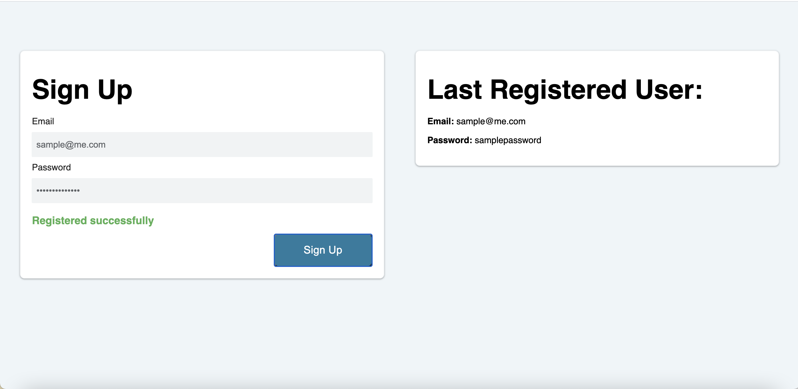

# 🏗️ Implement Local Storage for Sign-Up Form

Work with a partner to implement the following user story:

* As a developer, I want to save the email and password to localStorage and render the last submission to the page.

## Acceptance Criteria

* It's done when `Last Registered User: ` displays the last email and password saved to local storage, if it exists.

* It's done when the `signUpButton` is clicked, the email and password entered into the text boxes is saved to local storage and the information under `Last Registered User: ` is updated. 

## Assets

The following image demonstrates the web application's appearance and functionality:

---

## 💡 Hints

What methods do we use to set and get items to local storage? 

## 🏆 Bonus

If you have completed this activity, work through the following challenge with your partner to further your knowledge:

* Does local storage have an expiration date? What happens when the browser is closed?

Use [Google](https://www.google.com) or another search engine to research this.

---
2020 Trilogy Education Services, LLC, a 2U, Inc. brand. Confidential and Proprietary. All Rights Reserved.