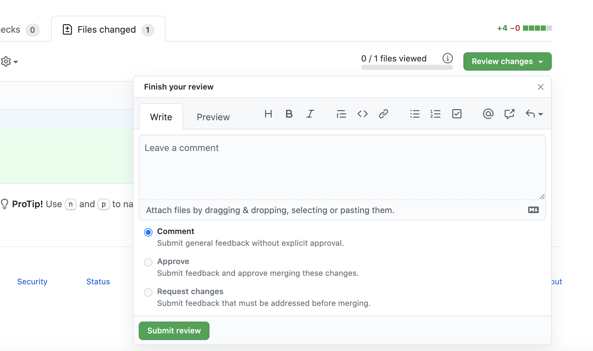
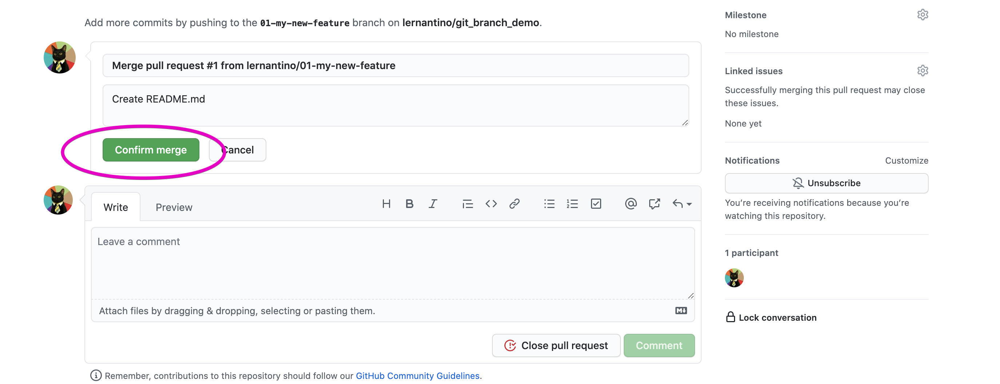
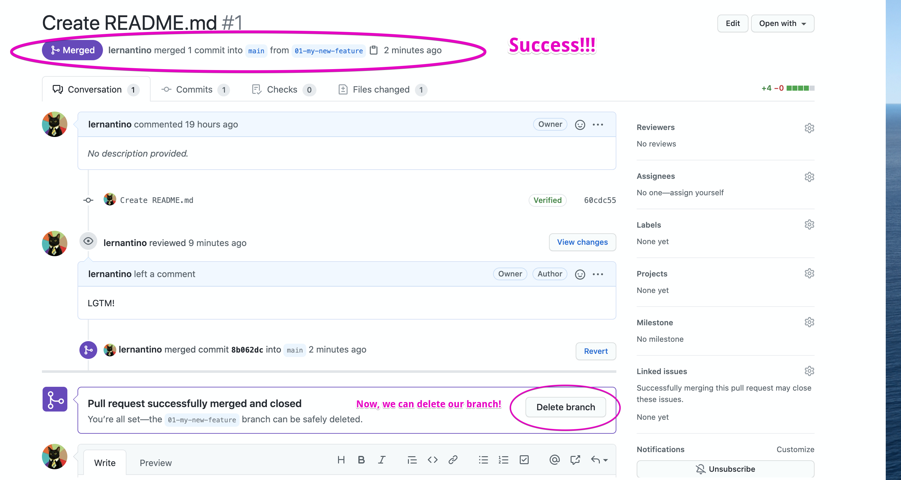

# Git Pull Requests

In the previous git guide activity, we practiced the basic workflow of creating a new feature branch, committing and pushing our work, and then merging the finished feature branch with the core code base. That workflow makes sense for a smaller solo project, but what about larger projects with multiple developers working on several features simultaneously? We can imagine that it would be helpful to have our team members review our code and vice versa to make sure that everything looks okay before merging. Luckily, Github has a pull request feature that lets us do that!

A pull request is a tool that allows us to collaborate on features after they are finished and before they are merged into a development branch or main code base. Once a feature branch is finished and ready for review, we can open a pull request and invite team members to review the code, comment on it, and even push their own commits. Pull requests not only provide a chance to catch bugs before merging, but they are also an important opportunity for developers to talk about features and decide if any modifications need to be made before moving forward.

In this activity, we will practice opening a pull request for a feature branch. For now, you will only leave comments and a review on your own code. In future activities, you will learn more about collaboration on github and have the chance to work with others. Once the review is finished, we will merge the pull request and delete the feature branch.

## Instructions

### Create the Repository, Clone, and Create a New Feature Branch

* Just like our other projects, we start by creating a new Github repository.

* Navigate to your GitHub account and create a new repository on GitHub called `pull-request-demo`. Make sure it's created with a `README.md` file by selecting the "Add a README file" checkbox. 


* Now let's clone the newly created repository to the local machine. We can start to do so by clicking the green Code button, selecting the SSH option, and copying the value provided.

* To perform the clone operation, you'll need to use the `git clone` command from your command line. Make sure that you've navigated to the location you want your repository to be cloned to using the `cd` command, and then clone the repo.

* Once it's done cloning to your machine, navigate to the cloned repository's directory using the `cd` command.

* Once you are in the directory of your repo, create and switch to a new branch by running the following command:

```bash
 git checkout -b 01-my-new-feature
```
### Make a Change in the Browser

* Let's update the project's `README.md` file. Go ahead and open it in your VS Code editor. 

* As of right now, there should just be the name of the repository listed using `#`, which is the markdown equivalent of an HTML `<h1>` element. Let's add some more to this file so there's a change to be tracked by Git. Add a message of your choice or the following markdown text to the `README.md` file below what's already there:

  ```md
  Now, I am a demo for a Pull Request!
  ```

* Great! Now let's run the following commands to add, commit, and push our work. Don't forget to include a descriptive message to your commit!

  ```bash
   git add -A
   git commit -m "<commit message>"
   git push origin 01-my-new-feature
  ```

* You have made changes, committed, and pushed your 'new feature'. Now, it's time to open a pull request!

### Open a Pull Request in the Browser

* Now that we've finished the changes to our new feature, it's time to open a pull request. Navigate to the repo page in your browser, you may see a message like the one in the image below. 


* If you see this message, you can click on the button labeled, "Compare & pull request". If you don't see this message, don't worry! You can click on the "Pull request" tab at the top of the screen. This will take you to the Pull request hub where you can open a pull request by clicking on the green, "New pull request" button, like in the following image:


* Now, you should see a form for opening a pull request. First, make sure that you are comparing the feature branch that you've been working on to the correct base. In a larger dev environment, it is likely that you will base your feature branch off of a `dev` branch to avoid corrupting the core code base. In this case, since our project is so tiny, you will compare `01-my-new-feature` to the base branch, `main`. For more information on comparing workflows, check out [this article!](https://www.atlassian.com/git/tutorials/comparing-workflows)

* Practice giving your pull request a descriptive title and leaving comments for for teammates and/or reviews. A comment should include details about the changes in your feature branch that you would like to merge.

* The side panel offers other optional settings for your pull request. You can assign a reviewer (in this case, you will be reviewing your own work), add assignees, or labels to help you organize your pull requests. These options are important to be aware of and useful when you are working on bigger projects, but we will leave them blank for now.

* Once you are finished filling out the form, click on the green button at the bottom labeled, "Create pull request".

  

* Now, you are ready to review your pull request!

### Review Pull Request

* Once you have successfully opened your pull request, look for and click on the "Files changed" tab, and it should take you to a page that is similar to the image below. Once you are on this page, you are able to view all of the changes that have been made. You can make comments on these changes by clicking on the `+` signthat appears when the mouse hovers over the code.

* This page is also where you can begin a review of the changes. Click on the green button, labeled, "Review changes" on the right, as shown by the following image:

  

* Once you click on the "Review changes" button, a box will appear that looks like the following image. Enter a comment of your choice, (i.e. `LGTM!`) in the comment box. You have the option of providing feedback without approval, approving the merge, or requesting changes to be completed before merging. Select the first option, "Comment", and then click the `Submit review` button.

  

* Upon clicking Submit, you will be redirected to the "Conversation" tab, where you will see the comment that you just left in your review, a histoy of commits, and a button to merge the pull request. 

 

### Merge and Close Pull Request

* Now that you've left a review and you don't need to make anymore changes to your feature branch, you can merge and close your pull request!

* Click on the green button, "Merge pull request". Then you should get a request asking you to confirm the merge. Click the button that says, "Confirm merge".



* Success! Git offers the option to delete the remote feature branch. We are finished with our feature, so go ahead and click on, "Delete branch".



* Great! Now, let's delete the feature branch locally.

### Delete Local Branch

* You deleted the remote feature branch in the browser, now let's delete the feature branch locally too! It's goog practice to delete a local branch once you have merged your feature to stay organized. We can imagine how many branches that we might open working on a larger project with many features.

* Navigate to the repo directory in your terminal, if you aren't there already. Run the following commands to switch to `main`, pull changes, and begin your next feature:

   ```bash
   git checkout main
   git pull origin main
   git branch -d 01-my-new-feature
   git checkout -b 02-my-next-feature
   ```
* That's it!

### Recap

* Let's recap what you just accomplished: You created a new repo and a new feature branch. You made changes to the repo on your feature branch, then you added your changes, committed changes with a message, and pushed those changes to the remote branch. Once you were finished, you opened a pull request, comparing your feature branch with the base, `main`. You left a review of your changes, you successfully merged the feature branch with `main` and deleted the feature branch remotely. Finally, you pulled the changes to you local `main` branch and deleted the local feature branch. Wow!

### Hints

* Ask an instructor or TA if you get stuck or have any questions!

* Check the [Atlassian guide on Git Pull Requests](https://www.atlassian.com/git/tutorials/making-a-pull-request) for reference.

---
© 2020 Trilogy Education Services, LLC, a 2U, Inc. brand. Confidential and Proprietary. All Rights Reserved.