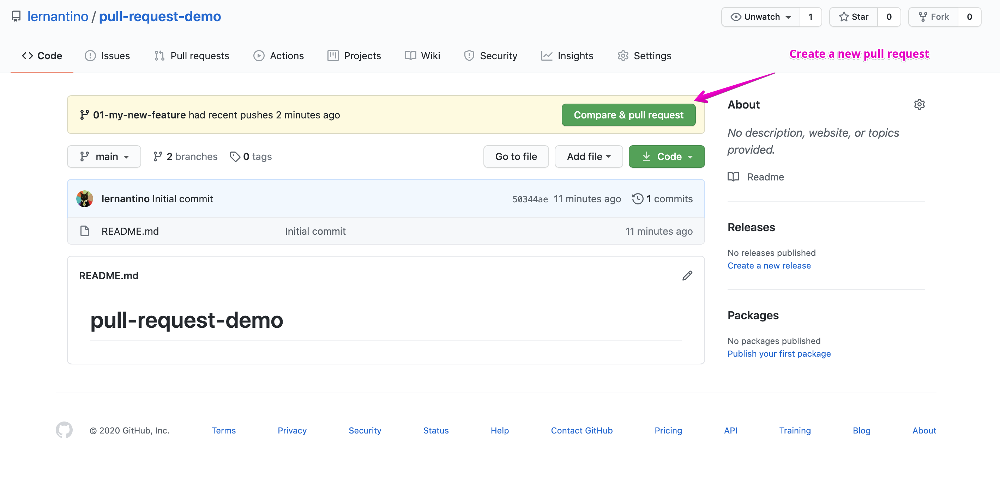
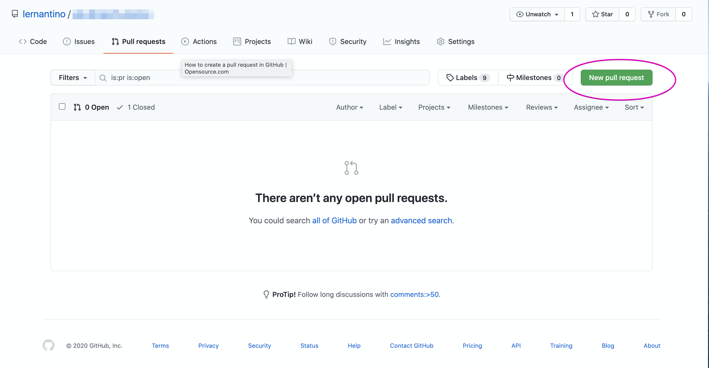

# Git Pull Requests

Previously, we practiced creating a new feature branch, committing and pushing the work, and then merging the finished feature branch with the core codebase. That basic workflow makes sense for a small solo project, but what about larger projects, with multiple developers working on several features simultaneously? Luckily, Github's pull request feature accommodates team development work!

A **pull request** allows us to collaborate on features after they're finished and before they're merged into a development branch or main codebase. Once a feature branch is finished and ready for review, we can open a pull request and invite team members to review the code, comment on it, and even push their own commits. Pull requests not only provide a chance to catch bugs before merging but also enable developers to discuss new features and any necessary modifications before moving forward.

In this activity, you'll open a pull request for a feature branch. For now, you'll only leave comments on and review  your own code. In future activities, you'll learn more about collaboration on GitHub and have the chance to work with others. Once the review is finished, you'll merge the pull request and delete the feature branch.

## Instructions

Just like other projects, we'll start by creating a new GitHub repository.

### Create the GitHub Repository

Navigate to your GitHub account and create a new repository called `pull-request-demo`. Make sure to select the "Add a README file" checkbox. You should see something like the following image:


### Clone the New Repository

Now let's clone the newly created repository to the local machine. We can start to do so by clicking the green Code button, selecting the SSH option, and copying the value provided.

Before you perform the clone operation, use the `cd` command to navigate to the location where you want the repo cloned. Then, to clone it, you'll need to run the `git clone` command from your command line.

### Create a New Feature Branch

Once the repository is done cloning to your machine, navigate to the cloned repo's directory by using the `cd` command.

In the directory of this repo, create and switch to a new branch by running the following command:

```bash
 git checkout -b 01-my-new-feature
```
### Make a Change in the Browser

Time to update the project's README.md file. Go ahead and open it in your VS Code editor. 

As of right now, you should see just be the name of the repository listed, along with `#`, which is the markdown equivalent of an HTML `<h1>` element. Add more to this file to create some changes for Git to track! You can enter a message of your choice or copy the following markdown text to the README.md file&mdash;below what's already there:

```md
Now, I am a demo for a Pull Request!
```

Great! Now let's run the following commands to add, commit, and push the work:

```bash
  git add -A
  git commit -m "<commit message>"
  git push origin 01-my-new-feature
```

> **Note:** Don't forget to include a descriptive message to your commit.

You've made changes, committed, and pushed your new feature. Now it's time to open a pull request!

### Open a Pull Request in the Browser

After making these changes to the new feature, you'll need to open a pull request. Navigate to the repo page in your browser. You might see a message like the one shown in the following image: 



If you see this message, select the "Compare & pull request" button. If you don't see this message, don't worry! You can click on the "Pull requests" tab at the top of the screen. This will take you to the pull request hub. On this page, you can open a pull request by clicking on the green "New pull request" button, like in the following image:



Now you should see a form for opening a pull request. First, make sure that you are comparing the feature branch that you've been working on to the correct base. In a larger dev environment, it is likely that you will base your feature branch off of a `dev` branch to avoid corrupting the core code base. In this case, because the project is so tiny, you will compare `01-my-new-feature` to the base branch, `main`. 

> **Deep Dive:** For more information, read this [Atlassian article on comparing workflows](https://www.atlassian.com/git/tutorials/comparing-workflows).

Practice giving your pull request a descriptive title and leaving comments for teammates and/or reviews. A comment should include details about the changes in your feature branch that you would like to merge.

The side panel offers other optional settings for your pull request. You can assign a reviewer (in this case, you will be reviewing your own work), add assignees, or labels to help you organize your pull requests. These options are important to be aware of and useful when you are working on bigger projects, but we will leave them blank for now.

Once you are finished filling out the form, click on the green button at the bottom labeled, "Create pull request", as shown in the following image:


Now you're ready to review your pull request!

### Review Pull Request

Once you have successfully opened your pull request, look for and click on the "Files changed" tab, and it should take you to a page that is similar to the following image. Once you are on this page, you can view all of the changes that have been made. You can make comments on these changes by clicking on the `+` sign that appears when the cursor points at the code.

This page is also where you can begin a review of the changes. Click on the green button, labeled, "Review changes" on the right, as shown in the following image:


Once you click on the "Review changes" button, a box will appear. Enter a comment of your choice, (i.e. `LGTM!`) in the comment box. You have the option of providing feedback without approval, approving the merge, or requesting changes to be completed before merging. Select the first option, "Comment", and then click the `Submit review` button, as shown in the following image:


On clicking Submit, you will be redirected to the "Conversation" tab, where you will see the comment that you just left in your review, a histoy of commits, and a button to merge the pull request. It will look something like the following image:


### Merge and Close Pull Request

Now that you've left a review and you don't need to make any more changes to your feature branch, you can merge and close your pull request!

Click on the green button, "Merge pull request". Then you should get a request asking you to confirm the merge. Click the button that says, "Confirm merge", as shown in the following image:


Success! Git offers the option to delete the remote feature branch. We are finished with the feature, so go ahead and click on, "Delete branch", as shown in the following image:


Great! Now, let's delete the feature branch locally.

### Delete Local Branch

You deleted the remote feature branch in the browser, now let's delete the feature branch locally too! It's goog practice to delete a local branch once you have merged your feature to stay organized. We can imagine how many branches that we might open working on a larger project with many features.

Navigate to the repo directory in your CLI, if you aren't there already. Run the following commands to switch to `main`, pull changes, and begin your next feature:

  ```bash
  git checkout main
  git pull origin main
  git branch -d 01-my-new-feature
  git checkout -b 02-my-next-feature
  ```

That's it!

### Recap

Let's recap what you just accomplished: You created a new repo and a new feature branch. You made changes to the repo on your feature branch, then you added your changes, committed changes with a message, and pushed those changes to the remote branch. Once you were finished, you opened a pull request, comparing your feature branch with the base, `main`. You left a review of your changes, you successfully merged the feature branch with `main` and deleted the feature branch remotely. Finally, you pulled the changes to you local `main` branch and deleted the local feature branch. Wow!

### Hints

Ask an instructor or TA if you get stuck or have any questions!

For more help, see the [Atlassian guide on Git pull requests](https://www.atlassian.com/git/tutorials/making-a-pull-request).

---
© 2020 Trilogy Education Services, LLC, a 2U, Inc. brand. Confidential and Proprietary. All Rights Reserved.
