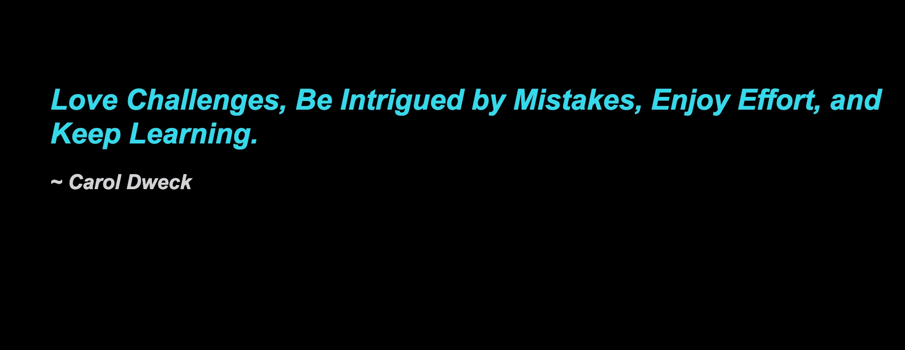

# DOM Elements with jQuery

In this activity, you will use jQuery to display a quote and its author.

## Instructions

* Open [`hello-unsolved`](Unsolved/hello-unsolved.html), examine the code, and do the following:
  
  *  Read the instructions in the `TODO:` comments to select, create, and modify the elements

## Hint(s) 

* Don’t forget to “incorporate” jQuery before you begin.

* Only use jQuery methods, do **NOT** use any of the following vanilla JavaScript methods: `createElement`, `textContent`, or `appendChild`.

## Bonus

* Explain the difference between `$("
")` vs `$("div")` in jQuery. 

* Research an alternative method that attaches elements as a sibling and not as a child

A completed activity will look like the following image:

