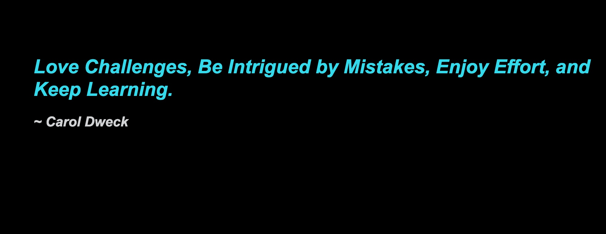

# 📖 Create HTML elements with jQuery

Work with a partner to implement the following user story:

* As a user, I want to be greeted with a quote by an author when I open the page.

## Acceptance Criteria

* It's done when the page dynamically displays a quote by an author and the author's name on load.

## 📝 Note(s)

Refer to the documentation: 

[jQuery API Docs](https://api.jquery.com/)

## Assets

The following image demonstrates the web application's appearance and functionality:

  

---

## 💡 Hint(s) 

* Don’t forget to add jQuery to `index.html` before you begin.

* Only use jQuery methods! Do **NOT** use any of the following vanilla JavaScript methods: `createElement`, `textContent`, or `appendChild`.

## 🏆 Bonus

* If you have fully completed the above tasks, here is something you and your partner can work through as an added challenge:
  
  * How can we add event listeners using jQuery?
  
* Use [Google](https://www.google.com) or another search engine to answer the above.
