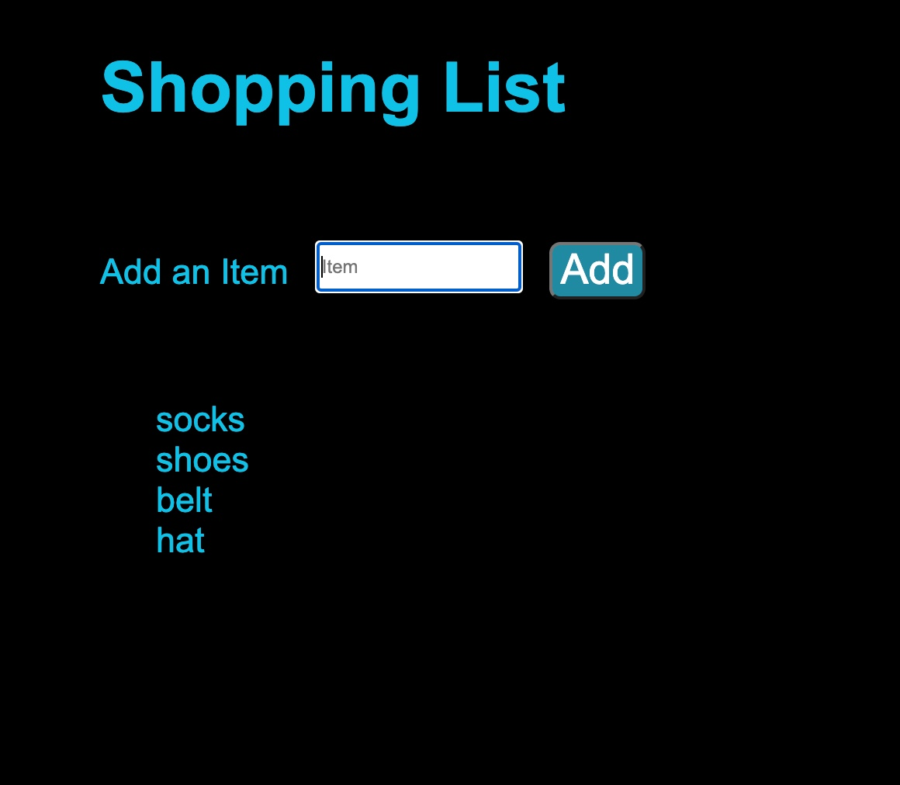

# Shopping List

In this activity, you will use jQuery to create a shopping list

Enter a value into the input field and click on the button to add the item to the shopping list

## Instructions

* Open [`shopping-unsolved`](Unsolved/shopping-unsolved.html), examine the code, and do the following:

  * Arrange the form elements using jQuery methods and attach the form to the `document` 

  * Add the event listener and event handler on the `form` for the `submit` event 
  
  * Clear the form on form submission

  * Follow the detailed instructions provided in the comments marked by `TODO:`
   

## Hint(s)
  
  * Prevent the default behavior of the `submit` event.
  
  * Use jQuery's `val` method to retrieve the input field's data.

## Bonus

  *  Change the order how the items are added to the shopping list, ie. if the item is added to the bottom of the list, now make it add to the top of the list. 

The finished shopping list should look like the following image:

