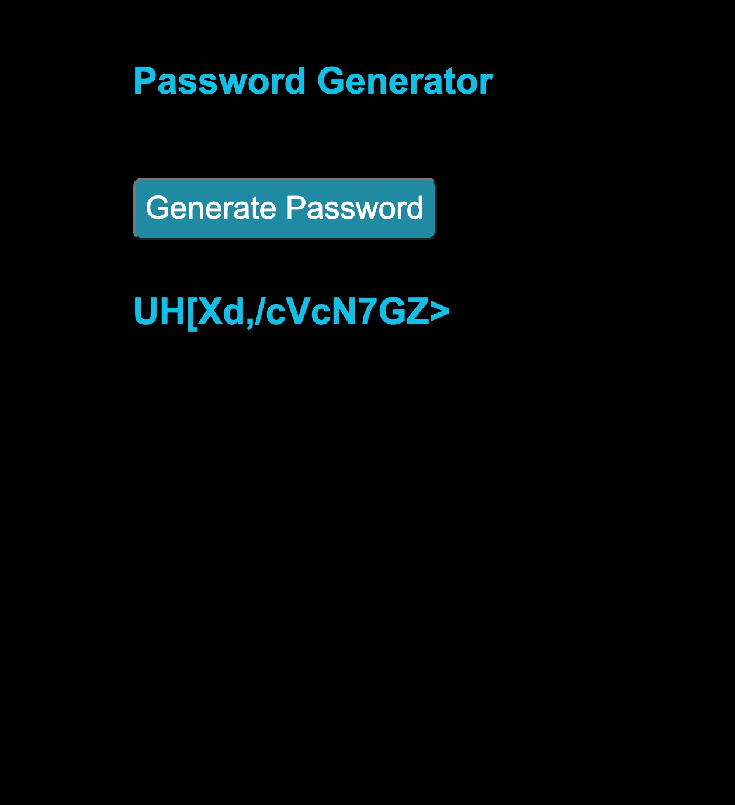

# Password Generator Debugger

In this activity, you will fix the following click event to generate a random 15 character password when the button is clicked.

Currently the random password is generated when the title of the website is clicked twice. The password also too short. Follow the instructions to fix the password generator.

## Instructions

* Open [`password-unsolved`](Unsolved/password-unsolved.html), examine the code, and do the following:
  
  * Attach the event listener to target the button
  
  * Modify the event listener so a single click of the button will generate a password

  * Change the event handler so the length of the generated password is 15 characters in length.

## Hint(s)  

* Research the [jQuery official documentation on events listeners](https://api.jquery.com/category/events/) to find the method that will provide the operation we require.

## Bonus 

* Research if/when the `$(document).ready()` is necessary by looking at the [jQuery's official documentation about `$(document).ready()`.](https://learn.jquery.com/using-jquery-core/document-ready/) 

* Search in the docs to find the alternative methods to add an event listener such as the `on` method.
  
The finished activity should look like the following image:

