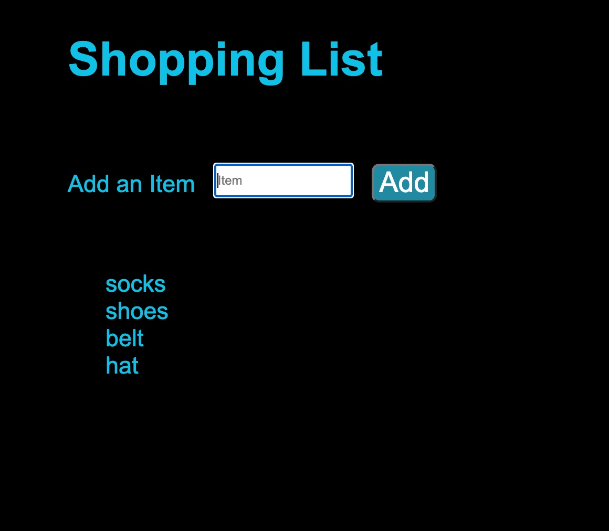

# jQuery Form Elements

In this activity, you will work with a partner to use jQuery documentation to determine how jQuery handles forms using jQuery methods like `submit()` and `val()` to create a shopping list.

## Instructions

* Be sure to work with your partner!

* Navigate to the [jQuery Docs on Forms](https://api.jquery.com/category/forms/) in your browser.

* Open [script.js](Unsolved/assets/js/script.js) and examine the code.

* Using the documentation, implement the following:

  * As a busy working parent, I want to be able to quickly create a shopping list for groceries.

  * When I enter an item to the shopping list form, it should appear on the page in a list of shopping items.

  * Follow the instructions provided by the comments in the starter code to arrange the form elements using jQuery methods and attach the form to the webpage.

  * Add the event listener and event handler on the `form` for the `submit()` event. 
  
  * Clear the form on form submission.

* The result should look like this image:

## 💡 Hint(s)

* Prevent the default behavior of the `submit()` event.

* What jQuery form method can you use to retrieve the input field's data?

## 🏆 Bonus

* If you have fully completed the above tasks, here is something you and your partner can work through as an added challenge:
 
  * Change the order of how the items are added to the shopping list.
  
  * For example, if the item is added to the bottom of the list, now make it added to the top of the list or vice versa.

* Use [Google](https://www.google.com) or another search engine to research how to do it.