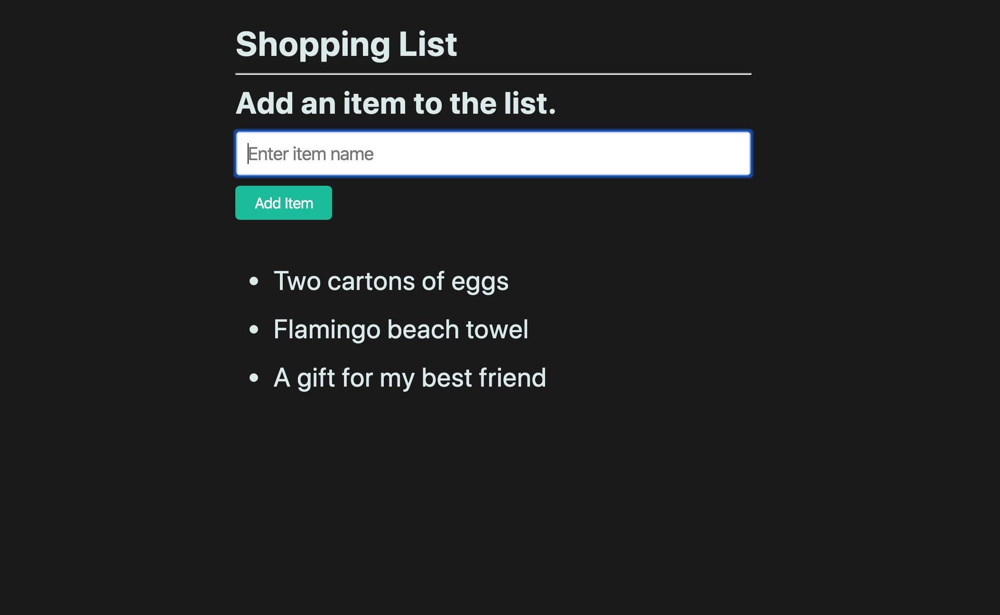

# 📖 Implement a Shopping List Form

Work with a partner to implement the following user story:

* As an online shopper, I want to be able to add a items to my shopping list so I can view them all in one place.

* As an online shopper, I want to be able to quickly add another item to my list. 

## Acceptance Criteria

* It's done when the form can be submitted and the value in the input field is captured and printed to the page as a list item.

* It's done when the form's input field is cleared upon a successful submission.

## 📝 Note(s)

Refer to the documentation: 

[jQuery Docs on Forms](https://api.jquery.com/category/forms/)

## Assets

The following image demonstrates the web application's appearance and functionality:

---

## 💡 Hint(s)

* Prevent the default behavior of the `submit()` event.

* What jQuery form method can you use to retrieve the input field's data?

## 🏆 Bonus

* If you have fully completed the above tasks, here is something you and your partner can work through as an added challenge:
 
  * How can we reset form elements using plain JavaScript?

* Use [Google](https://www.google.com) or another search engine to research how to do it.
