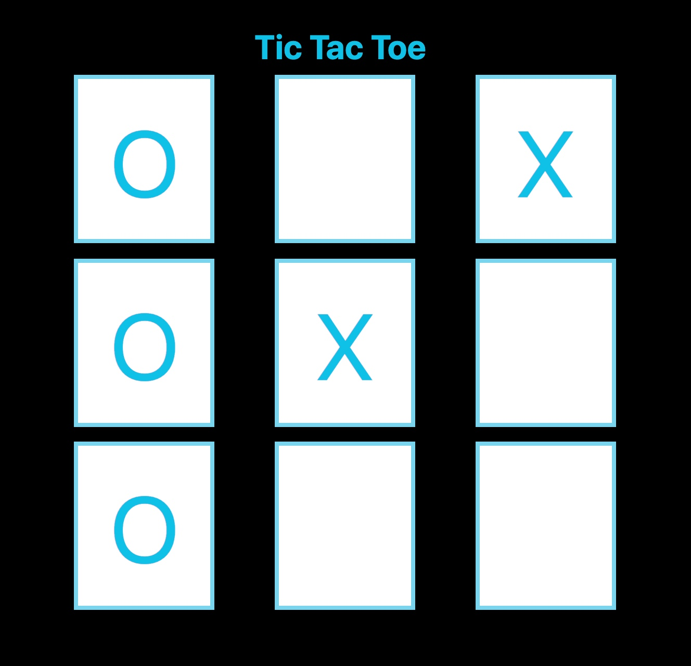

# jQuery DOM Traversal

In this activity, you will work with a partner to use jQuery DOM Traversal documentation to search the DOM for the requested elements in a game of Tic Tac Toe.

## Instructions

* Be sure to work with your partner!

* Navigate to the [jQuery Docs on traversing](https://api.jquery.com/category/traversing) in your browser.

* Open [index.html](Unsolved/index.html) and [script.js](Unsolved/assets/js/index.js) in your IDE and examine the code.

* Using the documentation, implement the following:

  * Add the statements that will accomplish the **three** requested actions noted by the `TODO:` in the comments. Read these instructions carefully and use the `HINT` provided if needed.
  
  * Starting from `
`, use DOM traversal methods in jQuery to select all nine tic-tac-toe boxes and change the background to white for greater legibility.
  
  * Starting from `
`, traverse down through the DOM tree and insert the "O" to block the "X" player from winning.
  
  * Starting from `
`, traverse up through the DOM tree and insert the "O" for the win. 

* The result should look like this image:

## 💡 Hint(s)  

* You are the "O" player. Place the "O" to block and win.

* Change the style of the element as you traverse through the DOM as a visual aid to track the current location. 
  
## 🏆 Bonus 

* If you have fully completed the above tasks, here is something you and your partner can work through as an added challenge:

  * What are some alternative methods to traverse up and down the DOM tree? 

* Use [Google](https://www.google.com) or another search engine to answer the above.
