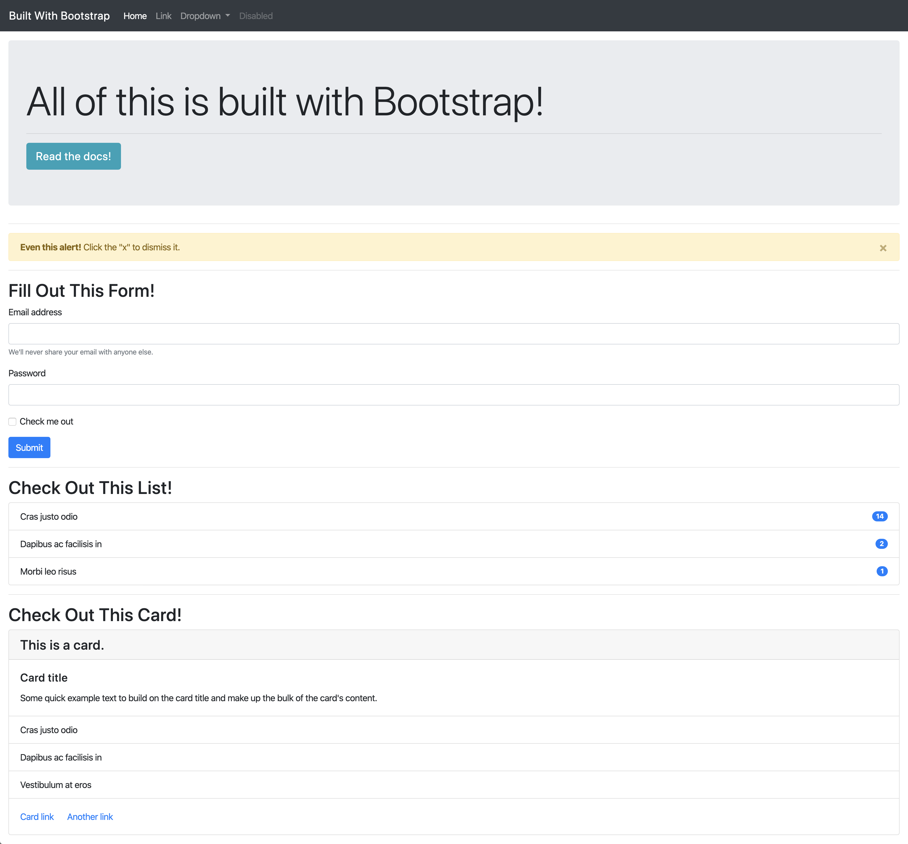

# 📖 Add Bootstrap Components to the Page

Work with a partner to implement the following user story:

* As a developer, I want to be able to quickly put together a web page without having to write custom CSS.

## Acceptance Criteria

* It's done when the page has a styled navbar.

* It's done when the page has a styled jumbotron.

* It's done when the page has a styled and dismissible alert box.

* It's done when the page has a styled form.

* It's done when the page has a styled list with badges.

* It's done when the page has a styled card with a list, header, and footer.

## 📝 Note(s)

Refer to the documentation: 

[Bootstrap documentation for Components](https://getbootstrap.com/docs/4.5/components/)

## Assets

The following image demonstrates the web application's appearance and functionality:

---

## 💡Hint(s)

* When in doubt, use the Bootstrap documentation links in the comments and Chrome DevTools to breakdown the classes and styles used!

* Look down the left-hand side of the Bootstrap documentation to see the different types of components.

## 🏆 Bonus

* If you have fully completed the above tasks, here is something you and your partner can look into to further your knowledge:

  * How did Bootstrap come to be and how are CSS frameworks like it useful for developers?

* Use [Google](https://www.google.com) or another search engine to research the above.
