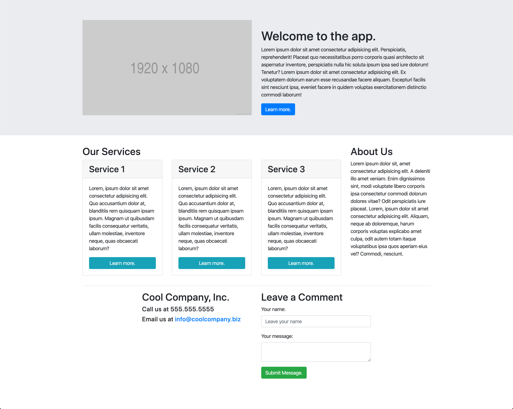

# 📖 Implement Responsive Layout

Work with a partner to implement the following user story:

* As developer, I want to be able to create a responsive layout without having to write custom CSS.

## Acceptance Criteria

* It's done when the page displays a multi-column layout on large screens and matches the mockup below.

* It's done when the screen displays in a single-column layout on smaller screens and matches how it looks currently.

## 📝 Note(s)

Refer to the documentation: 

[Bootstrap documentation for the Grid](https://getbootstrap.com/docs/4.5/layout/grid/)

## Assets

The following image demonstrates the web application's appearance and functionality:

---

## 💡 Hint(s)

* Don't forget to use the previous activity as a guide to how the classes can be used!

## 🏆 Bonus

* If you have fully completed the above tasks, here is something you and your partner can work through as an added challenge:

  * What are some ways Chrome DevTools can demystify the CSS powering the grid?

* Use [Google](https://www.google.com) or another search engine to research the above.
