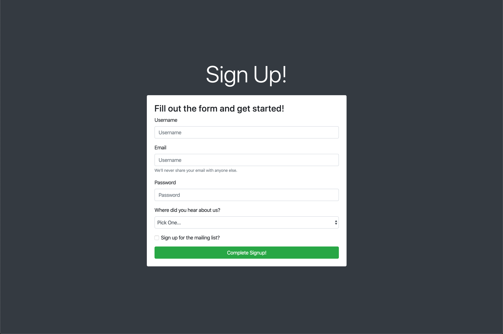

# Bootstrap Utility Classes

In this activity we will take a Bootstrap form component and use various utility classes to center it on the page and make it more visually appealing. 

## Instructions

* Using the [Bootstrap documentation for Utilities,](https://getbootstrap.com/docs/4.5/getting-started/introduction/) add to the existing code in [Unsolved file](./Unsolved/index.html) to match this image:

* Follow the instructions provided by the comments in the starter code. Read the comments carefully, as they will provide hints as to where you'll find your answer in the Bootstrap documentation.

## 💡 Hint(s)

Don't forget to use the previous example as a guide to how the classes can be used!

## 🏆 Bonus

Make this application look more personalized! Open Chrome DevTools and update some of the more generic styles to use different colors or font sizes.
