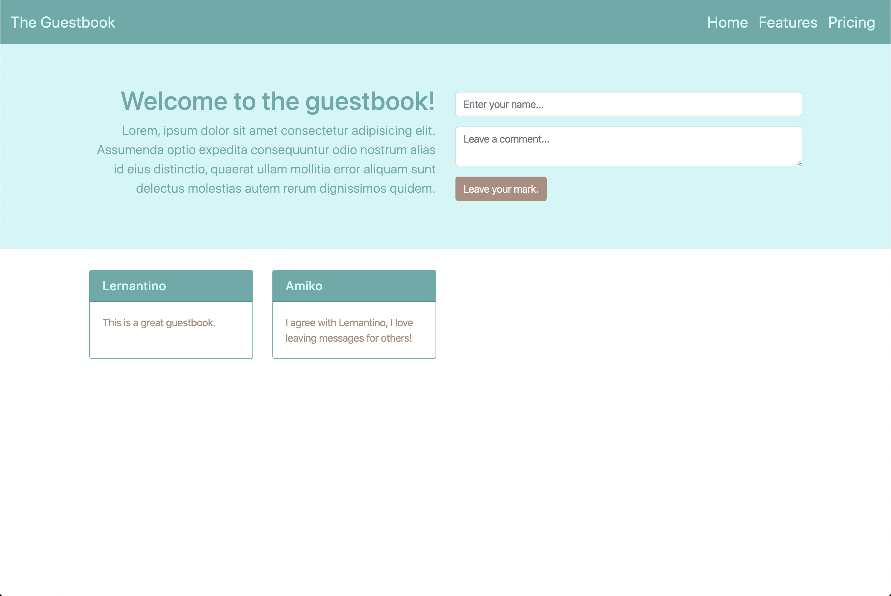

# Extending Bootstrap Styles

In this activity, you will work with a partner to take a page built with Bootstrap components and update the color styles to provide a custom theme using CSS.

## Instructions

* Be sure to work with your partner!

* Open [index.html](./Unsolved/index.html) and [script.js](./Unsolved/assets/js/script.js) in your IDE to examine the code and implement the following features:

  * We are given a guestbook that is using only the basic Bootstrap colors.

  * Follow the instructions provided by the comments in the starter code to apply CSS styles to the guestbook to make it more colorful!

* The result should look like this image:

## 💡 Hint(s)

* There is a color theme already available to use in `style.css`, but feel free to use [Adobe Color](https://color.adobe.com/).

* Don't forget to use the previous example as a guide to how custom styles can be applied with CSS.

## 🏆 Bonus

* If you have fully completed the above tasks, here is something you and your partner can look into to further your knowledge:

  * What are some other UI frameworks we could use? 
  
* Here are some to get you started: [Bulma](https://bulma.io/), [Materialize](https://materializecss.com/), and a very customizable one called [Tailwind.](https://tailwindcss.com/).