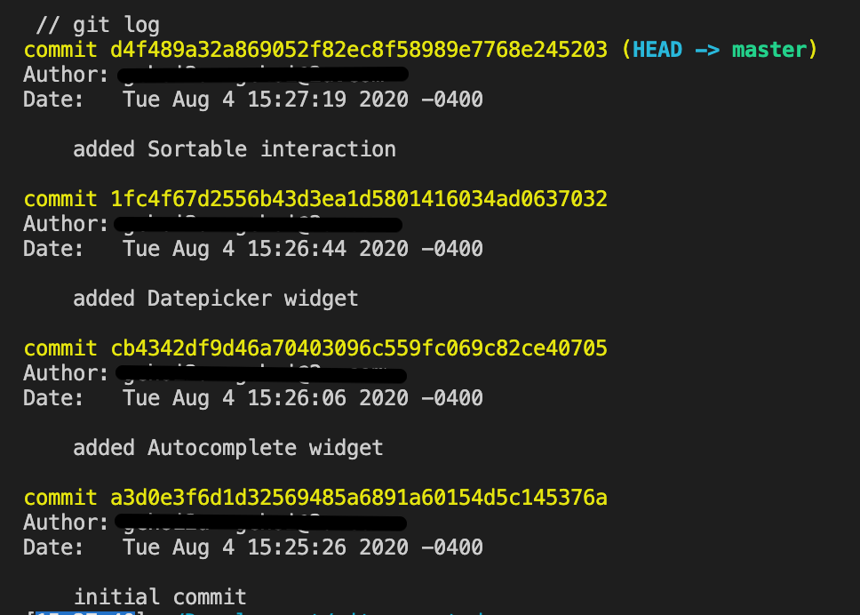
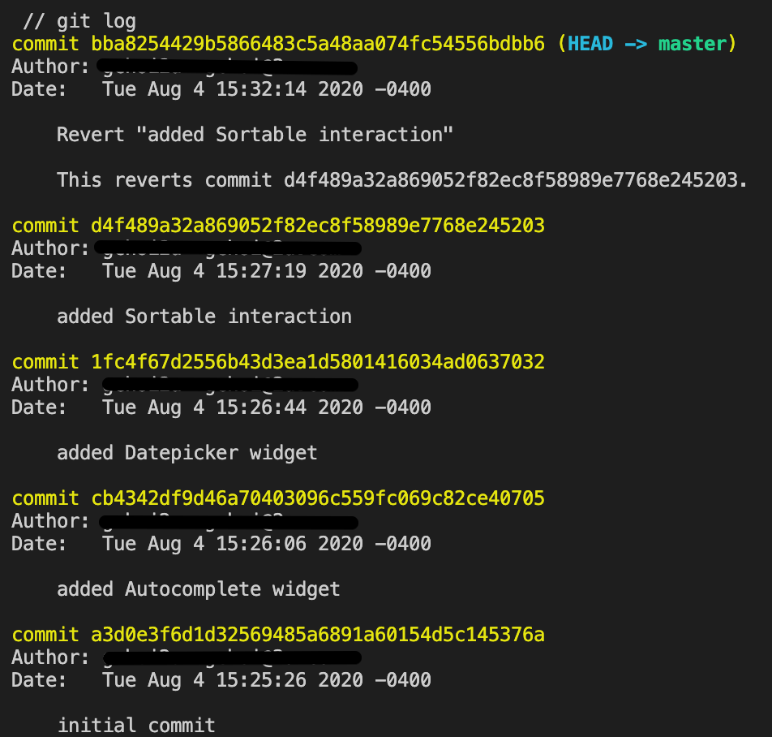

# Git Revert

In this activity, we will use `git revert` to undo a commit made earlier while keeping the commit history.

## Instructions

* Navigate to a directory where you usually store your coding files using your command line.

* Create a new directory called `git_revert_demo`, as follows:

  ```bash
  mkdir git_revert_demo
  ```

* `cd` into that newly created directory and initialize an empty git repo in the directory, as shown in the following example:

  ```bash
  cd git_revert_demo
  git init .
  ```
  
* Open the `git_revert_demo` directory in your IDE and copy the [script.js](./script.js) file into it. You'll notice it is the code from our previous activity on jQuery UI Interactions.

* Make the initial commit, as follows:

  ```bash
  git add .
  git commit -m 'initial commit'
  ```

* In the `git_revert_demo/script.js` file, add the code for the `Autocomplete` widget and save the file, like in the following example:

  ```js
  // Autocomplete widget
  $(function () {
    var skillNames = [
      'Bootstrap',
      'C',
      'C++',
      'CSS',
      'Express.js',
      'Git',
      'HTML',
      'Java',
      'JavaScript',
      'jQuery',
      'JSON',
      'MySQL',
      'Node.js',
      'NoSQL',
      'PHP',
      'Python',
      'React',
      'Ruby',
    ];
    $('#skill-name').autocomplete({
      source: skillNames,
    });
  });
  ```

* In your terminal, add and commit the changes, as follows:

  ```bash
  git add .
  git commit -m 'added Autocomplete widget'
  ```

* Repeat for the `Datepicker` widget, as shown in the following example

  ```js
  // Datepicker widget
  $(function () {
    $('#datepicker').datepicker({
      changeMonth: true,
      changeYear: true,
    });
  });
  ```

* Add and commit the changes, as shown in the following example:

  ```bash
  git add .
  git commit -m 'added Datepicker widget'
  ```

* Lastly, repeat for the `Sortable` interaction, as follows:

  ```js
  // Sortable interaction
  $(function () {
    $('#skills-list').sortable({
      placeholder: 'ui-state-highlight',
    });
    $('#skills-list').disableSelection();
  });
  ```

* Add and commit the changes, as shown in the following example:

  ```bash
  git add .
  git commit -m 'added Sortable interaction'
  ```

* In your terminal, run `git log` to see the commit history. You should see all 4 commits, like in the following image

  

* Let's say the `Sortable` interaction was a mistake and we want to revert back to before we made that commit. We can use the git command `git revert`.

* `git revert` requires a commit reference and will not execute without one. Pass in the `HEAD` which will revert the latest commit, as follows:

  ```bash
  git revert HEAD
  ```

* This will create a new commit, which will open the commit message editor prompting for a new commit message. When Git is finished, we can use `git log` to see that there is a new commit added, which reverted the `added Sortable interaction` commit. See the following image for reference:

  

* Check the `script.js` file to see if the `Sortable` interaction is no longer there.

* If we look at the [Git Revert Docs](https://git-scm.com/docs/git-revert#_options), we see various options we can also use. One useful one is the `--no-edit` option. This will not open the commit message editor and will automatically write a commit message for you.

* To test it, let's say that we want to revert the `added Autocomplete widget` commit. 

* In your terminal, run `git log` and make note of the commit number for the `added Autocomplete widget` commit.

* Use the `--no-edit` option in the `git revert` command, as follows:

  ```bash
  git revert --no-edit <add commit number>
  ```

* When we run `git log`, we can see the automatically generated commit message `Revert "added Autocomplete widget"` and when we check the `script.js` file, the widget is no longer there.

### Hints

* Ask an instructor or TA if you get stuck or have any questions!

* Check the [Git Revert Docs](https://git-scm.com/docs/git-revert) for reference.

---

© 2020 Trilogy Education Services, LLC, a 2U, Inc. brand. Confidential and Proprietary. All Rights Reserved.