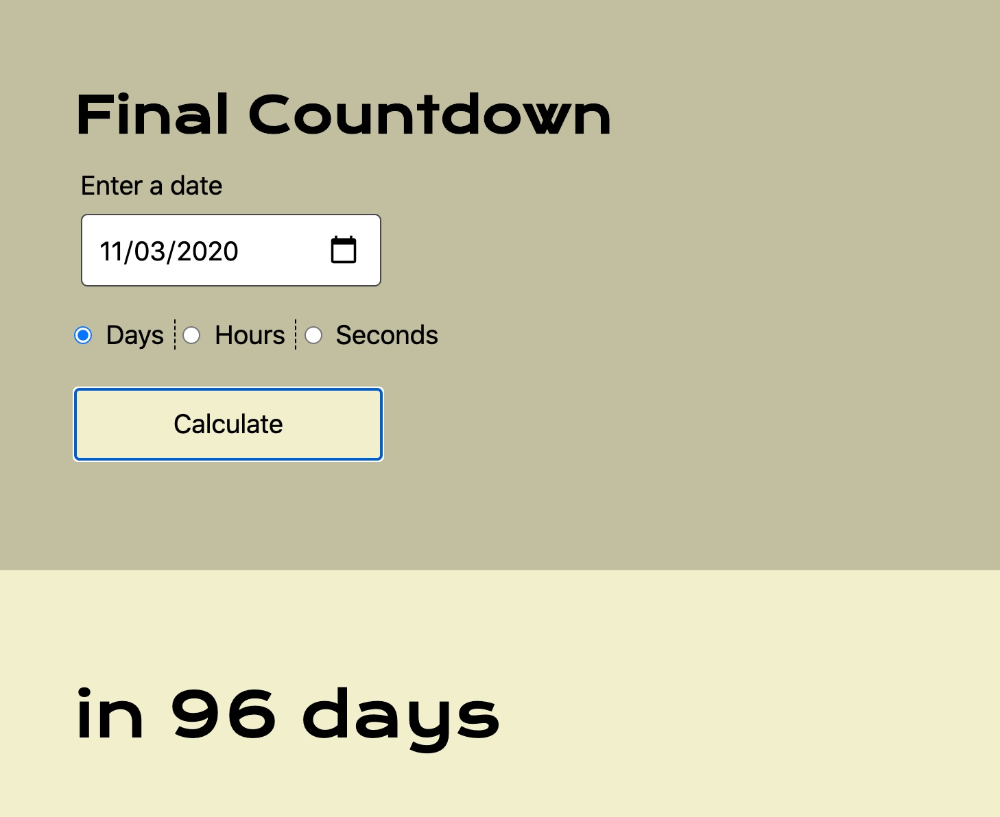

# Moment Countdown

In this activity, you will work with a partner to debug the code and fix the functionality.

Currently the button doesn't render the answer. Fix the `switch` statement so the button will trigger the correct results for each of the three options: seconds, minutes, and hours.

## Instructions

* Be sure to work with your partner!

* Open the [unsolved script file](./Unsolved/assets/js/script.js), examine the code, and fix the switch statement. 

  * Apply the correct logic in the switch case of the button click event handler so the answer is rendered in the requested units.

## 🏆 Bonus

* If you have fully completed the above tasks, here's something you and your partner can work through as an extra exercise. Place the form into a Bootstrap modal. [Research the Bootstrap docs for an example.](https://getbootstrap.com/docs/4.0/components/modal/) 

* Check the [solution](./Solved/assets/js/script.js) after class and compare it against your own file. 

## 💡 Hint(s)

* [`Moment.js` has an well organized set of documentation which has helped it remain popular.](https://momentjs.com/docs/#/query/)

* For an example of the solution, here is a demo in the following image:

