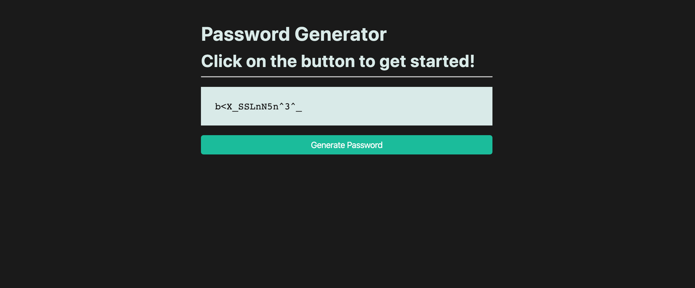

# 🐛 Password generator returns a single character only on double-click

Work with a partner to resolve the following issues:

* As a user, I should be able to click the Generate Password button only once to retrieve the password, not twice.

* As a user, I should be able to generate a 15-character password upon click. 

## Expected Behavior

When a user clicks the Generate Password button once, a 15-character password is printed to the page.

## Actual Behavior

When a user double-clicks the Generate Password button, a two-character password is printed to the page.

## Steps to Reproduce the Problem

1. Click on the Generate Password button once to see that nothing happens.

2. Double-click on the Generate Password button, and a single character password is printed on the page.

## Assets

The following image demonstrates the web application's appearance and functionality:

---

## 💡 Hint 

* Research the [jQuery docs on events listeners](https://api.jquery.com/category/events/) to find the method that will provide the operation we require.
  
## 🏆 Bonus 

If you have completed the activity and want to further your knowledge, work through the following challenge with your partner:

* What are alternative methods to add event listeners? Use [Google](https://www.google.com) or another search engine to answer this question.

---

© 2020 Trilogy Education Services, LLC, a 2U, Inc. brand. Confidential and Proprietary. All Rights Reserved.