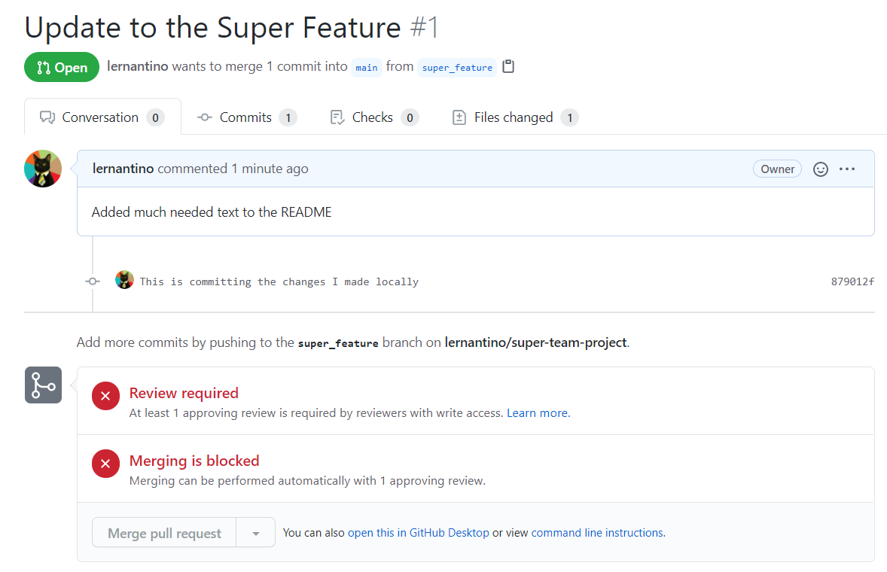

# Git Collaboration Flow

In this activity, we will walk through a situation to learn how to effectively collaborate with other developers on a web application that is hosted on GitHub. When working with a team, it's crucial for all members of the team to agree upon a workflow that ensures both the team's happiness the application's integrity. In web development, this workflow typically revolves around the use of Git and GitHub.

Having multiple developers work with code in a single repository can be hectic. To avoid conflict, developers 

## Instructions

Please refer to `25-Evr_Git-Repo-Setup` for instructions. This is a continuation of that activity.

### Create a New Feature Branch
Github allows us to create multiple branches off of our `main` branch. This gives us a way to test multiple different features at a time. By doing this we can have multiple people working on a project without breaking our `main` branch.

* Once you have the command line open, make sure you are in the right directory by using the command:

```
cd super-team-project
```

* You should now be inside your repository's directory. Now we have to create a new branch on this repository in order to work and for our changes not to effect the `main` branch. To do this enter the command below:

```
git checkout -b super_feature
```

* In the command line you should see:

```text
Switched to a new branch 'super_feature'
```

### Commit Changes to Feature Branch and Test Locally
* Now that we have a new branch it is time to make some changes. In the `README.md` add a few lines describing your favorite part of JavaScript so far. Don't spend to much time on this but give it quick thought.

```
I enjoy JavaScript because it utilizes both Functional programming and Object-oriented programming.
```

* Once we have made changes to the `super_feature` branch it is time to make sure your project still runs locally.

* If your project and its new feature is running as intended, save those changes to the `super_feature` branch. We do that with the following command:

```
git add
git commit "This is committing the changes I made locally"
```

* With `git add` we move our changes to a staging area which tells git we want to group these changes in git. It is important to know that `add` does not change the repository. The repository will change once you `commit` the changes.

### Push Feature Branch and Open Pull Request

* When you are happy with your new feature and you have tested it heavily, it is now time to open a pull request.

* Before we can make a pull request on Github, we first need to push our new feature to Github. The following command allows us to do that:

```
git push origin super_feature
```

* After pushing your branch you should see something similar to this in your command line:

```text
Total 0 (delta 0), reused 0 (delta 0), pack-reused 0
remote:
remote: Create a pull request for 'super_feature' on GitHub by visiting:
remote:     https://github.com/lernantino/super-team-project/pull/new/super_feature
remote:
To https://github.com/lernantino/super-team-project.git
* [new branch]     super_feature -> super_feature
```

* With our `super_feature` branch now on Github, it is time for us to open a pull request. A pull request will let your team members know you are ready to implement the new `super_feature` to the `main` branch.

* Navigate to the `super_feature` branch on Github by going to your repository page. Once on your repository's Github page, look for the dropdown menu called `main`. Click it and you should see the branches off your `main` branch. Click `super_feature`.


* Once we have chosen the correct branch, a green button should appear with the label "Compare & pull request".


* When creating a pull request it is best practice to be as descriptive as possible. It is important to let your team know exactly what you changed. 

* It is time to hit the "create pull request" button so it can be reviewed.


**Important:** Before submitting a pull request, make sure you are comparing your branch to `main`.

### Review Pull Request

* Earlier, we created a rule where you have to open a pull request and that pull request must be reviewed before you can merge a branch with `main`.



* On the right-hand side you should see a label "Reviewers", we use this for when we want a particular team member to review your pull request. The selected reviewer will be notified when the pull request is submitted. For the sake of this activity you will also be playing the role of reviewer. Normally you will have some type of agreement on how to review pull request amongst your team.


* Okay, we now have a pull request but it is important one of your team members (YOU) carefully reviews your pull request for any mistakes that could potentially break the `main` branch.

* We have to navigate to our repository on Github and click on the tab named "pull request".


* On this tab you will see a list of all the pull request for the specified branch. Right now you should only see the pull request you made but when working on bigger projects this number increases based how often you make changes to your project.


* Once on the pull request page you should be able to see a tab labeled "Files Changed".


* In this view you will be able to see a side-by-side comparison of what exactly has changed in your repository. This makes comparing code less painful and increases efficiency.


*  In the top right corner you should see a green button labeled "Review changes". Once you click on the "Review changes" button a forum will appear, you will have a few options. You can send a comment, send a comment along with approval to merge, or send a comment with changes that need to be made before merging. These tools play a key role in making sure your team stays focus and productive.


* It is important to carefully review all the changes because you don't want any unwanted bugs breaking your `main` branch.

### Merge Feature Branch and Close Pull Request

* We are approaching the final step, it's time to merge our branch with the `main` branch. 

* Once the pull request has been reviewed and tested, you are going to navigate to the appropriate pull request on Github. Locate and click the green button labelled "Merge pull request".


* You have the ability to add a comment with your merge before clicking confirm.

* Now you have merged your `super-feature` branch with the `main` branch. Github gives you the option to delete the branch you merged but that might not always be ideal. I would clarify with your team members before deleting a branch.


### Hints

* Ask an instructor or TA if you get stuck or have any questions!

* Check the [guide on GitHub flow](https://guides.github.com/introduction/flow/) for reference.
