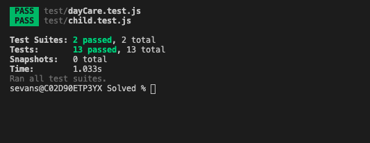

# 🐛 Running `npm run test` Results in Errors.

Work with a partner to resolve the following issue(s):

* As a developer, I would like to spy on the output of the `console.log` method in `dayCare.test.js`.

## Expected Behavior

* When we run `npm run test` in the console, we should not recieve an error

* When we run `npm run test` in the console, the Tests and Test Suites for `dayCare.test.js` should be passing

## Actual Behavior

* When we run `npm run test` in the console, we recieve the following error: "Cannot spyOn on a primitive value; undefined given"

* When we run `npm run test` in the console, the Tests and Test Suites for `dayCare.test.js` are not passing

## Steps to Reproduce the Problem

1. Navigate to the `Unsolved` folder in this activity.

2. Run `npm install` in your console.

3. Run `npm run test` in your console.

## Assets

The following image demonstrates the web application's appearance and functionality:

---

## 💡 Hints

* What does the error tell you about what is missing?

* How do we capture the value of `console.log`?

## 🏆 Bonus

If you have completed this activity, work through the following challenge with your partner to further your knowledge:

* Use the [Jest Docs](https://jestjs.io/docs/en/jest-object#jestspyonobject-methodname) to explain two or three other methods that can be used in conjunction with `.spyOn`.

Use [Google](https://www.google.com) or another search engine to research this.

---
© 2020 Trilogy Education Services, LLC, a 2U, Inc. brand. Confidential and Proprietary. All Rights Reserved.