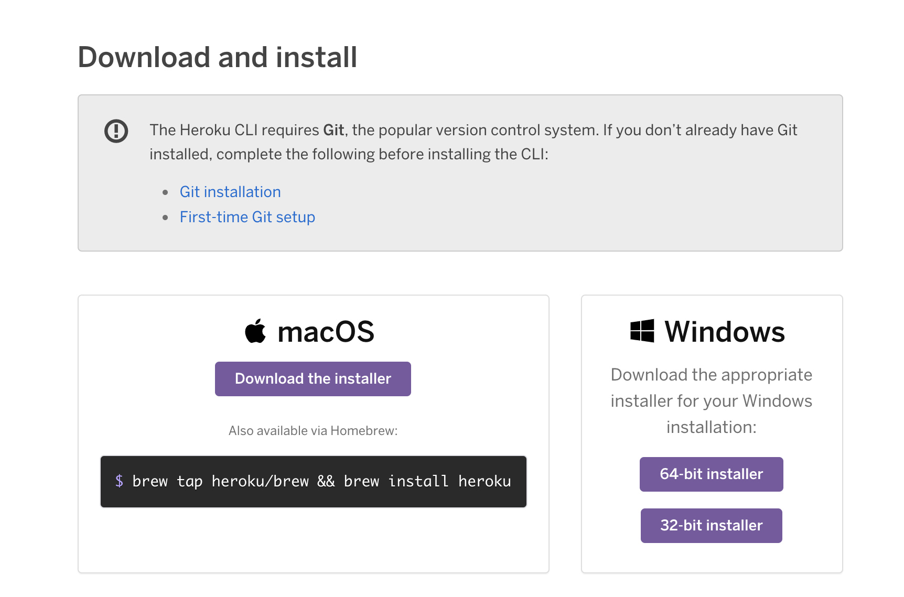

## Heroku CLI Installation Guide

* Sign up for a free [Heroku](https://signup.heroku.com/) account.

* Download the appropriate [installer](https://toolbelt.heroku.com/) for the Heroku CLI depending on your OS.

* Follow the prompts to complete the installation.

* Open your Terminal (Mac) or Command Prompt (Windows). 

  * **Note:** Command Prompt, or cmd.exe, comes preloaded on Windows operating systems, but the exact location will vary depending on your version of Windows. You can locate Command Prompt using the search feature.

* To verify your CLI installation, type `heroku --version` into the command line. 

* After you confirm that the Heroku CLI was installed correctly, type `heroku login` into the command line.

* You'll be prompted to enter any key to go to your web browser to complete login. The CLI will then log you in automatically. 