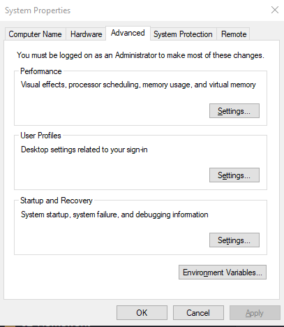
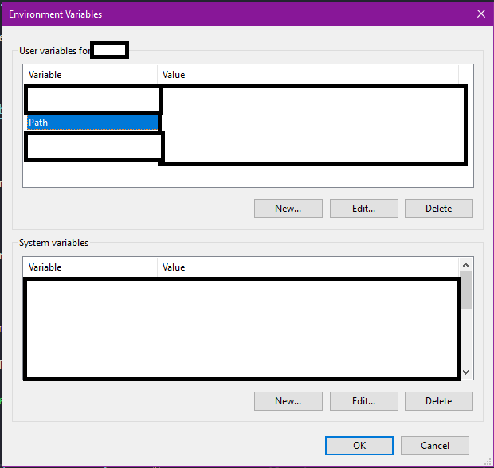
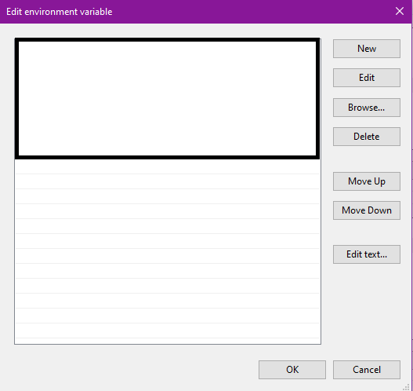

## MySQL Server Installation Guide (Windows)

* Head to <https://dev.mysql.com/downloads/windows/installer/8.0.html>

* Select Windows (x86, 32-bit), MSI Installer (16.3 M)

* Click “No thanks, just start my download.”

* Navigate to where the file was downloaded and double-click to run the installer. If you get prompted for an update, proceed with the upgrade.

* When you get to the License Agreement screen, Accept the license terms and click “Next”

* Click the “+” next to “MySQL Servers” to expand it, expand “MySQL Server”, expand “MySQL Server 8.0”, and finally select “MySQL Server 8.0.12 – X64” and click the right arrow to add it to the “Products/Features To Be Installed” section.

* Click “Execute”

* When the status says “Complete”, click “Next”.

* At the product configuration screen, click “Next” again.

* Select “Standalone MySQL Server / Classic MySQL Replication” and click “Next”

* For Type and Networking, don’t change anything and click “Next”

* **IMPORTANT**: Make sure to select “Use Legacy Authentication Method (Retain MySQL 5.x Compatibility) and click “Next”

* Create a root password. WARNING. Do not forget this password! After entering a password, click “Next”

* When you get to the Windows Service screen, don’t change anything and click “Next”

* Finally, click “Execute” to apply the changes.

* You can verify that the installation was correct by going to Git Bash and typing “mysql –V”. The path followed by the version should show up.

## MySQL Workbench Install (Windows)

* Head to <https://dev.mysql.com/downloads/workbench/>

* Select Microsoft Windows in the dropdown.

* Scroll down and in `Other Downloads:` find Windows (x86, 64-bit), MSI Installer and click “Download”.

* Click “No thanks, just start my download.”

* Open the executable file and go through the installation process.

## PATH setup

* Now that we have installed MySQL, we need to make sure to add the PATH to the MySQL install to our Environmental Variables.

* First press the `windows` key and search for PATH.

* Click the option `Edit the system environmental variables`.

* You should be prompted with this screen.

* Next, click `Environmental Variables`. You should be prompted with the following.

* Click `PATH`, and the click the `Edit...` button. You should be prompted with this screen.

* Click `New...`, and enter the path to the new MySQL Install. 

* Click `OK` on all the screens, and you are done. Restart your terminal completely for commands like `mysql x` to work.
