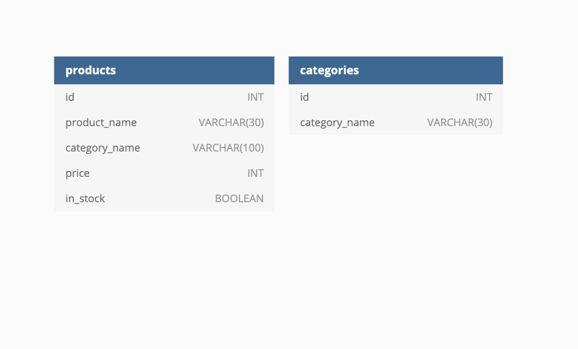

# 🏗️ Design Schema With Tables

Work with a partner to implement the following user story:

* As a developer, I want to design a schema that contains two tables. 

## Acceptance Criteria

* It's done when the schema includes two tables.

* It's done when each table has three columns and each column has a defined data type and constraint.

* It's done when the schema matches the diagram below.

## Assets

The following image demonstrates the web application's appearance and functionality:

---

## 💡 Hints

* What MySQL command do we use to display a table and information about each field's data types? 

## 🏆 Bonus

If you have completed this activity, work through the following challenge with your partner to further your knowledge:

* What are some issues we can avoid by having a well designed schema?

Use [Google](https://www.google.com) or another search engine to research this.

---
© 2021 Trilogy Education Services, LLC, a 2U, Inc. brand. Confidential and Proprietary. All Rights Reserved.
