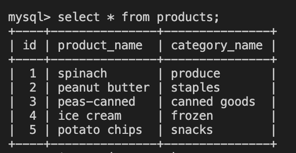

# 🐛 Seed Data Not Populating Table

Work with a partner to resolve the following issue(s):

* As a developer, I should be able populate my table with seed data.

## Expected Behavior

When the `seeds.sql` file is executed in the MySQL Shell, the data should populate my table.

## Actual Behavior

When the `seeds.sql` file is executed, the data is not successfully populated in the table. 

## Steps to Reproduce the Problem

1. Execute `schema.sql` in MySQL Shell to create the database and table.

2. Execute `seeds.sql` in MySQL Shell to populate data in the table. 

3. Run command `SELECT * FROM products;` to view seeded data.

## Assets

The following image demonstrates the web application's appearance and functionality:

---

## 💡 Hints

What MySQL statement do we use to add data to a table? 

## 🏆 Bonus

How can you alter an existing table? 

If you have completed this activity, work through the following challenge with your partner to further your knowledge:

Use [Google](https://www.google.com) or another search engine to research this.

---
© 2021 Trilogy Education Services, LLC, a 2U, Inc. brand. Confidential and Proprietary. All Rights Reserved.
