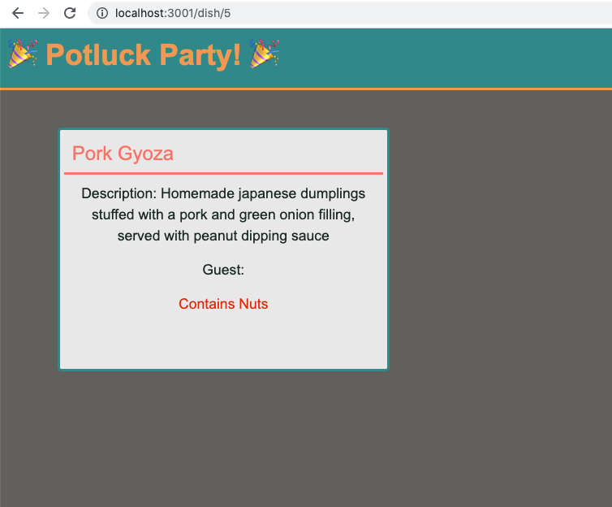

# 📖 Conditionally Render Food Allergens

Work with a partner to implement the following user story:

* As a party guest, I want to know if a food item contains nuts.

## Acceptance Criteria

* It's done when the view displays the message "Contains Nuts" under the food items that contain nuts.

## 📝 Notes

Refer to the documentation: 

[Handlebars.js: Built-in Helpers](https://handlebarsjs.com/guide/builtin-helpers.html#if)

## Assets

The following image demonstrates the web application's appearance and functionality:

---

## 💡 Hints

* Which built-in helper conditionally renders a block?

## 🏆 Bonus

If you have completed this activity, work through the following challenge with your partner to further your knowledge:

* Which built-in helper method is the inverse of #if? What is a use-case for rendering a block if an expression is a falsy value? 

Use [Google](https://www.google.com) or another search engine to research this.

---
© 2020 Trilogy Education Services, LLC, a 2U, Inc. brand. Confidential and Proprietary. All Rights Reserved.