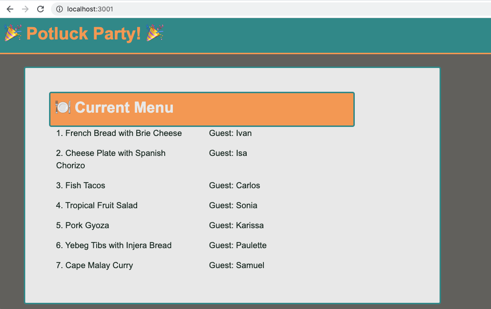

# 🐛 Main View is not Displaying Food Items 

Work with a partner to resolve the following issue(s):

* As a party guest, I would like to view a full menu of food items that other guests will bring to the party.

## Expected Behavior

* When a party guest views the page, they see a menu of food items.

## Actual Behavior

* When a party guest views the page, no food items appear on the menu.

## Steps to Reproduce the Problem

1. Run `npm install`. 

2. Make sure that mysql is turned on and run `node seeds/index.js` to seed the database.

3. Run `npm start`.

2. Navigate to http://localhost:3001/ in your browser.

## Assets

The following image demonstrates the web application's appearance and functionality:

---

## 💡 Hints

* How can you change your route so that the view is able to display the menu of food items?

## 🏆 Bonus

If you have completed this activity, work through the following challenge with your partner to further your knowledge:

* What are other options that you have to serialize data down to the properties that you need? 

Use [Google](https://www.google.com) or another search engine to research this.

---
© 2020 Trilogy Education Services, LLC, a 2U, Inc. brand. Confidential and Proprietary. All Rights Reserved.