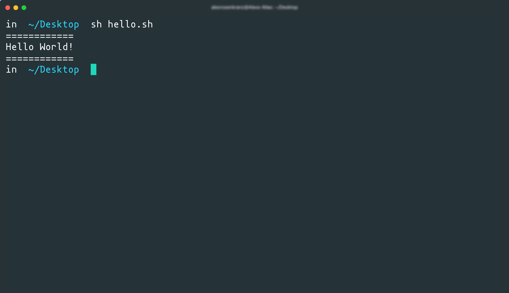

# Shell Scripts

## Introduction

Throughout all of our work so far, we've used the command line to perform numerous important tasks. These tasks include actions built into our computers, performing Git commands and interacting with GitHub or Heroku, and running Node.js applications or installing modules with `npm`. Lucky for us, a lot of these commands we perform on a daily basis work pretty well, but we still haven't learned exactly _how_ these commands run. In this activity, we're going to formally introduce ourselves to what's known as our Unix shell environment and write small programs to be executed from the command line.

The Unix shell environment serves as a layer between us and our computers, giving us access to commands built into our systems. We know this already because we've been using them all along! Commands such as `touch`, `mkdir`, `cd`, and more are all Unix shell commands that allow us to communicate with our computers. These are just a few commands that we use, but interactivity like this is just one part of our shell environment. We can also use the shell as an environment to run programs, much like Node.js, in the form of shell scripts.

A Unix shell script uses its own syntax that may feel familiar to commands we write using JavaScript. While Node.js has many modules that allow us to execute similar commands, shell scripts allow us to write more universal and lightweight functionality to perform and automate tasks that JavaScript may not be as well-suited for. 

> **Important**: Windows computers using Git Bash and older macOS versions use what's known as a Bash shell environment. Apple computers running newer versions of macOS have switched to use the "Z shell" environment (known as ZSH), which is backwards compatible with the Bash shell environment.
>
> These two environments are nearly identical for our needs, so all of the commands we go over today will be the same for each operating system or shell environment, but there will be a few differences we'll address as we go.

## Our First Script

Like learning any other programming language, it's best to get an understanding of how we write and execute shell scripts with a simple "Hello World" application, so let's start there. 

Shell scripts can be stored in files, much like a Node.js application's JavaScript code, so go ahead and navigate to a location on your computer where you want to keep this script and create a file with the following command:

```sh
touch hello.sh
```

Once that file is created, open it in Visual Studio code and add the following line to the top of the file:

```sh
#!/bin/bash
```

This line of code is crucial for this file to be executed correctly on the command line. It is what's known as a [shebang interpreter directive](https://en.wikipedia.org/wiki/Shebang_(Unix)), and it instructs the machine running the file how the following syntax in the file should be interpreted and executed. In this case, we're instructing the machine running the file that its contents should be interpreted and executed using the bash program installed on the machine.

While the shebang interpreter directive is important, it actually has nothing to do with the actual functionality of our script, so let's add that now with the following code:

```sh
# print "Hello World!" to the command line 
echo "============"
echo "Hello World!"
echo "============"
```

The hashtag symbol `#` is what we use for writing comments in our scripts, but what do we think the `echo` command does? This command is what we use to print data. In this case, we want to print the phrase "Hello World!" on one line with dividing lines above and below it, so we use three different `echo` statements.

That's all we need to do for this simple first application, so let's test it. Go ahead and save the file and navigate to where this file is from your command line and run the file with the following command:

```sh
./hello.sh
```

You likely ran into a permissions error that looks something like the following codeblock: 

```sh
# it may say something other than `zsh`
zsh: permission denied: ./hello.sh
```

That's okay! By default, new files we create on our computers don't grant permission to be executed, so we need to change that. Run the following command from the command line:

```sh
# use `chmod` to enter "change mode"
chmod +x ./hello.sh
```

With the `chmod` command, we can adjust a file or directory's permissions and control whether it can be read from, written to, or executed by different types of users on the machine (including the machine itself). Since we only need to execute this file, we use the `+x` modifier to allow the file to be executed. Learn more about the [chmod command and how it's used.](https://en.wikipedia.org/wiki/Chmod)

Now try to run the file again. Your command line should look something like this image after it runs:



Great, congratulations on writing and running your first script! While this is great, we can also set up our scripts to be executed from anywhere on our machines, allowing us to contextualize our scripts to whatever directory we are running the script from. To accomplish this, we need to create what's known as an "alias" in our shell environment that executes the file for us.

Aliases need to be created in a specific file that is automatically interpreted and executed every time we start up our command line applications. This file may differ depending on your operating system, but it's either `.bashrc` or `.zshrc` and they both will be located at the root path of our computers, so let's go look for them now. The "rc" in these files stands for "run commands", and helps contextualize some settings to our shell environment to our needs when it starts up.

From the command line, use `cd ~` to get to the root our computers and then use `ls -a` to see if the file exists. If it doesn't exist, we'll have to create it with the `touch` command. If you're on a Windows or older version of macOS, you'll need to create a `.bashrc` file. If you're on a newer version of macOS, you'll need to create a `.zshrc` file instead.

Once those files are created or located, open them in Visual Studio code and add the following line to the file:

```sh
# fill in the path to your `hello.sh` file, starting at the root of your machine
# there should be no space between the command definition and value
alias hello="~/<path>/<to>/hello.sh"
```

Using the `alias` command, we instruct our shell to define the command `hello` and give it a value of the path to our `hello.sh` file. Think of it as creating a shortcut or bookmark so we can save time by not typing out it's path every time. It's very important that there is no space between the command definition and value assignment, so make sure there is no space around the equal sign `=`.

Once that's done, save your file. This `hello` command won't be available just yet, we need to restart our command line applications so our updated run commands file will be read and the `hello` command will become defined. 

After restarting your command line application, simply type in the following command from anywhere on your command line:

```sh
hello
```

Great! Now we can run this command from anywhere on our machines. This is a very small example of the functionality implemented by programs we've installed on our machines such as `git`, `node`, and `npm`. While we just created a simple script to be executed, those other programs are filled with entire libraries of functionality that are made executable on our machines.

Let's move onto another example and learn how to make a slightly more useful script.

## Build a Script That Accepts User Input

Another good way to pick up a new programming language is to create an application that accepts predictable input to provide an output, so let's build a shell script calculator application to learn how to perform these more complex operations.

Create a file on your computer called `calculator.sh` and open it in Visual Studio Code. Since this is a shell script, we need to add the shebang `#!` interpreter directive to the top of the file with this code:

```sh
#!/bin/bash
```

Once that's in place, let's get the base functionality set up. We're going to use a `while` loop to continuously run this program until we say otherwise, let's add the following code:

```sh
# create a variable to keep track if we want to keep using the calculator
runCalculator="y"

# while the value of `runCalculator` is 'y' for 'yes', run the calculator functionality
# use `;` between statements to terminate one and begin the other, or simply move the second statement to the following line
while [ $runCalculator = "y" ]; do

  # our functionality will run in here

done
```

First we set up a variable called `runCalculator` and set it to "y". We then use the `while` loop to continuously do the code between the `do` and `done` commands until `runCalculator` is not "y" anymore. We access variables using a dollar sign `$` and use semi-colons `;` to separate multiple commands that appear on a single line.

Now let's fill out our actual functionality. In between the `do` and `done`, enter the following code:

```sh
# clear the command line for a cleaner experience
clear

# create a variable called `result` and set it to 0
result=0

# print prompt to the command line
echo "Enter first number:"
# use `read` command to capture command line input and store it in `num1` variable
read num1
echo "Enter second number:"
read num2

# print possible operations
echo "What operation would you like to perform? (Select number of one of the following)"
echo "Press '1' for addition"
echo "Press '2' for subtraction"
echo "Press '3' for multiplication"
echo "Press '4' for division"
# prompt for operation input
read operation
```

Every time the `do` command runs, we use the `clear` command to clear the command line of it's previous content. We then create a variable `result` to hold the eventual output of our calculator.

Next we need to somehow get input from our users and store them in variables, so we use the `read` command to capture that input and store it in variables for `num1`, `num2`, and `operation`. We can test this if we want to now by saving the file, giving it permission to be executed, and running it, but we'll need to use `Ctrl+C` to quit the application since the loop will always run for the time being.

Next, we check what the value of our `operation` variable is and perform that operation on `num1` and `num2`. Let's add the following code below what we previously added:

```sh
# use `case` to check operation value
case $operation in
  # if we selected `1`, set result equal to $num1 + $num2
  1) result=$(($num1 + $num2));;

  # use $() to interpolate values, much like a template literal in JavaScript (e.g. `${num1 + num2}`)
  2) result=$(($num1 - $num2));;

  # use `;;` to terminate case, like `break;` in JavaScript `switch`
  3) result=$(($num1 * $num2));;

  4) result=$(($num1 / $num2));;

  *) result="Invalid choice";;

# end switch case with `esac` (which is "case" backwards)
esac
```

Here we use the shell version of a `switch case` operation in JavaScript. We check to see if the value of `operation` is one of the cases listed between the `case` and `esac` commands, each case is defined by going to the left of a right parenthesis `)`. 

Depending on the case, we set the value of `result` to the resulting value of the operation performed on `num1` and `num2`. We use `$()` to interpolate a value, much like a template literal in JavaScript. The inner parentheses are to first get a result of the operation and then interpolate the finished result to be saved to the `result` variable. If no predefined choice is selected, we use the wildcard case `*` as the default and save an error message.

Now that we have this finished, let's print the result and ask the user if they'd like to perform another calculation. Add the following code into the `while` loop under what we just added:

```sh
# print result
echo "Result: $result"

# ask if we want to run calculator again
echo "Do u want to continue (y/n)) ?"
# overwrite 
read runCalculator
# if we said 'no' and `runCalculator` is now "n", exit program
if [ $runCalculator != "y" ]
then
  exit
fi
```

Here we print the result to finish the calculation and then prompt the user to go again. We then check if `runCalculator` is not "y" anymore and exit the application if true. Otherwise, the `while` loop continues and we can run through the calculator again.

Give this a test, don't forget to set the file's permissions! Afterwards, feel free to alias this script and run it anywhere you need to.

Congratulations on getting quickly acclimated to a new programming language! While these scripts we created aren't the most useful, they allowed us to learn how some more advanced scripts may work. We can write scripts to perform a number of tasks and automate a lot of things such as cleaning up Git repositories, finding where something exists in a project, and even scaffolding a project's file structure itself!

In your spare time, look in the `Solved` directory for a couple of more scripts to try and use yourself to see what else can be done.

## Resources

* https://wiki.bash-hackers.org/

* https://learnxinyminutes.com/docs/bash/

* https://devhints.io/bash

---
© 2020 Trilogy Education Services, LLC, a 2U, Inc. brand. Confidential and Proprietary. All Rights Reserved.
