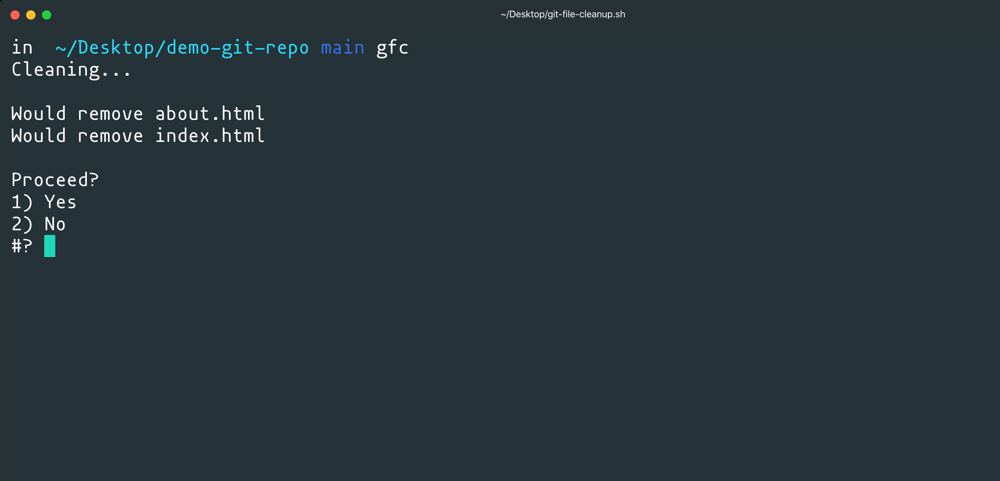
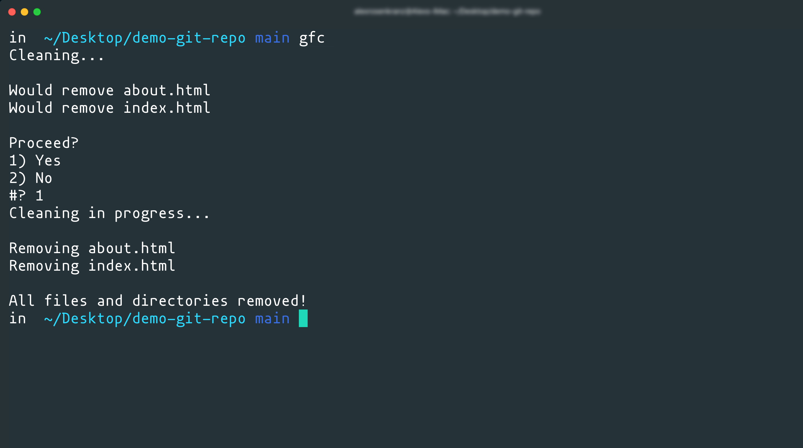

# Shell Scripts

## Introduction

Throughout all of our work so far, we've used the command line to perform numerous important tasks. These tasks include actions built into our computers, performing Git commands and interacting with GitHub or Heroku, and running Node.js applications or installing modules with `npm`. Lucky for us, a lot of these commands we perform on a daily basis work pretty well, but we still haven't learned exactly _how_ these commands run. In this activity, we're going to formally introduce ourselves to what's known as our Unix shell environment and write small programs to be executed from the command line.

The Unix shell environment serves as a layer between us and our computers, giving us access to commands built into our systems. We know this already because we've been using them all along! Commands such as `touch`, `mkdir`, `cd`, and more are all Unix shell commands that allow us to communicate with our computers. These are just a few commands that we use, but interactivity like this is just one part of our shell environment. We can also use the shell as an environment to run programs, much like Node.js, in the form of shell scripts.

A Unix shell script uses its own syntax that may feel familiar to commands we write using JavaScript. While Node.js has many modules that allow us to execute similar commands, shell scripts allow us to write more universal and lightweight functionality to perform and automate tasks that JavaScript may not be as well-suited for. 

> **Important**: Windows computers using Git Bash and older macOS versions use what's known as a Bash shell environment. Apple computers running newer versions of macOS have switched to use the "Z shell" environment (known as ZSH), which is backwards compatible with the Bash shell environment.
>
> These two environments are nearly identical for our needs, so all of the commands we go over today will be the same for each operating system or shell environment, but there will be a few differences we'll address as we go.

## Our First Script

Like learning any other programming language, it's best to get an understanding of how we write and execute shell scripts with a simple "Hello World" application, so let's start there. 

Shell scripts can be stored in files, much like a Node.js application's JavaScript code, so go ahead and navigate to a location on your computer where you want to keep this script and create a file with the following command:

```sh
touch hello.sh
```

Once that file is created, open it in Visual Studio code and add the following line to the top of the file:

```sh
#!/bin/bash
```

This line of code is crucial for this file to be executed correctly on the command line. It is what's known as a [shebang interpreter directive](https://en.wikipedia.org/wiki/Shebang_(Unix)), and it instructs the machine running the file how the following syntax in the file should be interpreted and executed. In this case, we're instructing the machine running the file that its contents should be interpreted and executed using the bash program installed on the machine.

While the shebang interpreter directive is important, it actually has nothing to do with the actual functionality of our script, so let's add that now with the following code:

```sh
# print "Hello World!" to the command line 
echo "============"
echo "Hello World!"
echo "============"
```

The hashtag symbol `#` is what we use for writing comments in our scripts, but what do we think the `echo` command does? This command is what we use to print data. In this case, we want to print the phrase "Hello World!" on one line with dividing lines above and below it, so we use three different `echo` statements.

That's all we need to do for this simple first application, so let's test it. Go ahead and save the file and navigate to where this file is from your command line and run the file with the following command:

```sh
./hello.sh
```

Depending on your operating system, you may have run into a permissions error that looks something like the following codeblock: 

```sh
# it may say something other than `zsh`
zsh: permission denied: ./hello.sh
```

That's okay! With some operating systems, new files we create on our computers don't grant permission to be executed by default, so we need to change that. Run the following command from the command line:

```sh
# use `chmod` to enter "change mode"
chmod +x ./hello.sh
```

With the `chmod` command, we can adjust a file or directory's permissions and control whether it can be read from, written to, or executed by different types of users on the machine (including the machine itself). Since we only need to execute this file, we use the `+x` modifier to allow the file to be executed. Learn more about the [chmod command and how it's used.](https://en.wikipedia.org/wiki/Chmod)

Now try to run the file again. Your command line should look something like this image after it runs:


Great, congratulations on writing and running your first script! While this is great, we can also set up our scripts to be executed from anywhere on our machines, allowing us to contextualize our scripts to whatever directory we are running the script from. To accomplish this, we need to create what's known as an "alias" in our shell environment that executes the file for us.

Aliases need to be created in a specific file that is automatically interpreted and executed every time we start up our command line applications. This file may differ depending on your operating system, but it's either `.bashrc` or `.zshrc` and they both will be located at the root path of our computers, so let's go look for them now. The "rc" in these files stands for "run commands", and helps contextualize some settings to our shell environment to our needs when it starts up.

From the command line, use `cd ~` to get to the root our computers and then use `ls -a` to see if the file exists. If it doesn't exist, we'll have to create it with the `touch` command. If you're on a Windows or older version of macOS, you'll need to create a `.bashrc` file. If you're on a newer version of macOS, you'll need to create a `.zshrc` file instead.

Once those files are created or located, open them in Visual Studio code and add the following line to the file:

```sh
# fill in the path to your `hello.sh` file, starting at the root of your machine
# there should be no space between the command definition and value
alias hello="~/<path>/<to>/hello.sh"
```

Using the `alias` command, we instruct our shell to define the command `hello` and give it a value of the path to our `hello.sh` file. Think of it as creating a shortcut or bookmark so we can save time by not typing out it's path every time. It's very important that there is no space between the command definition and value assignment, so make sure there is no space around the equal sign `=`.

Once that's done, save your file. This `hello` command won't be available just yet, we need to restart our command line applications so our updated run commands file will be read and the `hello` command will become defined. 

After restarting your command line application, simply type in the following command from anywhere on your command line:

```sh
hello
```

Great! Now we can run this command from anywhere on our machines. This is a very small example of the functionality implemented by programs we've installed on our machines such as `git`, `node`, and `npm`. While we just created a simple script to be executed, those other programs are filled with entire libraries of functionality that are made executable on our machines.

Let's move onto another example and learn how to make a slightly more useful script.

## Build a Script to Automate Git Tasks

Now that we've learned how to write a shell script, let's create one that will make our lives easier by automating a Git command to clean our repositories. 

Go ahead and create a file called `git-file-cleanup.sh` and open it in Visual Studio Code. Then make sure you add the shebang `#!` interpreter directive at the top of the file with the following code:

```sh
#!/bin/bash
```

With that in place, we can now start our script's functionality. We're going to write a script that when executed in a Git repository, it will check for untracked files and ask if we want to clean them up. This is useful when we have files we don't want to track or commit to our repo and don't want to remove them one-by-one.

Let's add the following code to our `git-file-cleanup.sh` file:

```sh
# set git clean command with necessary flags
# -f to force delete files (git won't remove them by default)
# -d to recursively check directories in repo and not just the level the command was run
# -n to perform a dry-run first, meaning it will identify files but not remove them
TO_REMOVE=`git clean -f -d -n`;
```

Here, we create a variable called `TO_REMOVE` and set it to a value of the `git clean` command. This command allows us to remove any untracked files from a project. We use the `-f` flag to force delete them from the computer, the `-d` flag to recursively check every directory in the repo, and finally the `-n` flag to make the command's execution a "dry run". 

The dry run means that it'll go through all the steps it normally goes through, but it'll just report back what will be removed without actually removing them. This is good because it'll give us a chance to check what will be removed before we remove them so we can confirm whether or not we want to proceed.

Before adding that user input for confirmation, let's run a check to see if there's anything even there for us to clean by adding the following code: 

```sh
# if the command's execution doesn't return `null`
if [[ -n "$TO_REMOVE" ]]; then
  echo "Cleaning...";
  # use printf to execute the expression that `TO_REMOVE` variable holds
  printf "\n$TO_REMOVE\n\n";
  
else
  echo "Everything is clean";
fi;
```

With this `if` statement, we use an a set of double square brackets `[[ <condition> ]]` to ensure that any white spaces in the string output by the execution of `TO_REMOVE` aren't read as separate arguments. To access a variable, we use the dollar sign `$`. 

If the executed Git command returns and it's not null, as checked by the `-n` flag, we will then move into our functionality. If it is null, we'll print a message indicating everything is clean and finish the `if` statement with `fi` (a lot of shell commands end with the opening command reversed). Notice the semi-colon `;` after the `if` statement? That's so we can start a new statement `then` on the same line.

If there is something to clean, let's move into the `then` statement and use the `printf` command to actually execute the command held in the `TO_REMOVE` variable and print the output of it to the command line application, just as if you were to run that command yourself. Once that's printed, we can now prompt the user to confirm if they want to move forward with the cleaning.

Add the following to the file after the `printf` and before the `else`:

```sh
# use `select` command to prompt a list of options to be displayed for picking and store in `result` 
select result in Yes No; do
  # if we say "yes" in the prompt...
  if [[ "$result" == "Yes" ]]; then
    echo "Cleaning in progress...";
    echo "";
    # execute `git clean -f -d`
    git clean -f -d;
    echo "";
    echo "All files and directories removed!";
  fi
  break;
done;
```

Here is where we add a bit of interactivity to our script. With the use of the `select` command, we prompt the user for "Yes" or "No" input on the command line and once they answer, the response will be stored in a variable called `result`.

Once we answer the prompt, we use the `do` command to continue the functionality. We check to see if we said "Yes" to cleaning our repo and if so, we actually execute the command as if we were typing out ourselves on the command line. If we don't say yes, or the command finishes, we use the `break` command to exit our `do` loop and then use `done` to signify the end of the that set of functionality.

That's all there is to this script, so let's give it a test. Since this one needs to be executed within the context of a Git repository, it'll be easier if we set up the alias first. If you need to adjust the permissions on your file, do so now with this command on the command line:

```sh
chmod +x ./git-file-cleanup.sh
```

Once that's done, add an alias to your `.bashrc` or `.zshrc` file with the following code:

```sh
# set the path to where your `git-file-clean.sh` file is
alias gfc="~/<path>/<to>/git-file-cleanup.sh"
```

Save your run command file that you just updated and restart your command line application for the alias to be loaded into the environment. Once that's done, let's test it out by creating a local Git repo on our machines. You can do so with these commands:

```sh
# make directory
mkdir demo-git-repo
# step into directory
cd demo-git-repo
# initialize a new git repo
git init
```

Now if you execute the command `gfc` from the command line, you'll notice a message return stating the repo is clean already, as this image shows:


That's because we haven't made any untracked files just yet. Let's add a few files, add one to be tracked, and then run the command again. Use the following commands to do so:

```sh
# create a couple files
touch index.html about.html README.md

# only set up the README to be tracked
git add README.md

# run `gfc` command
gfc
```

After running the above commands, the result of the `gfc` command should look something like this image:



Now we have identified what could be removed if we were to execute this command, thanks to the dry run (`-d`) flag, and can now decided if we want to move forward. If we select `1` for yes, then we will go through with the cleaning, as this image shows:



Now our Git repository is clean of all untracked files! This may not be a command you need to run all the time, it is a good way to see how we can optimize our workflows by writing scripts like this. 

Congratulations on getting quickly acclimated to a new programming language! While the scripts we created aren't very complex, they allowed us to learn how some more advanced scripts may work. We can write scripts to perform a number of tasks and automate a lot of things such as monitoring your computer's performance, finding where something exists in a project, and even scaffolding a project's file structure itself!

In your spare time, look in the `Solved` directory for a couple of more scripts to try and use yourself to see what else can be done.

## Resources

* https://wiki.bash-hackers.org/

* https://learnxinyminutes.com/docs/bash/

* https://devhints.io/bash

---
© 2020 Trilogy Education Services, LLC, a 2U, Inc. brand. Confidential and Proprietary. All Rights Reserved.
