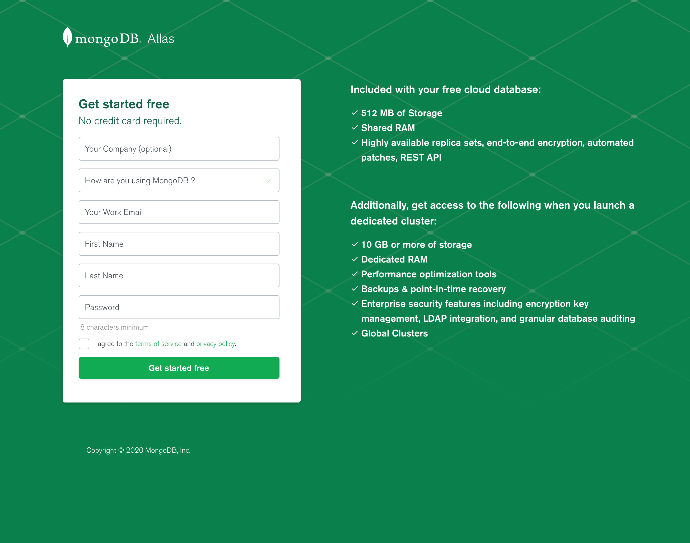
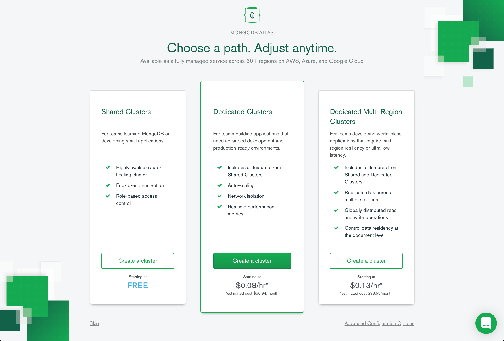
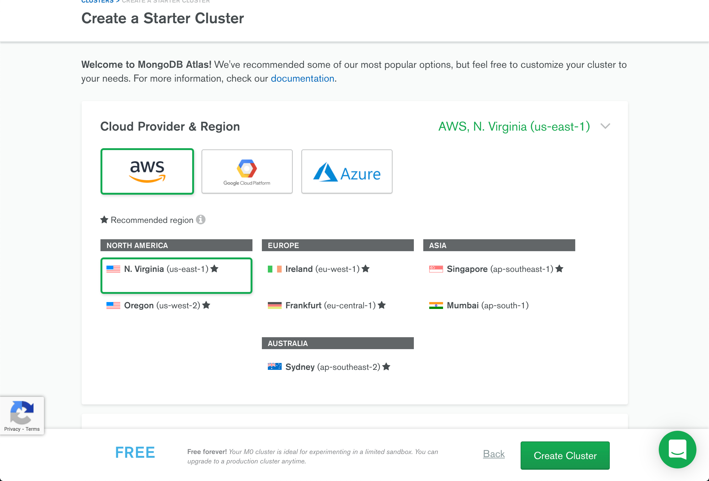
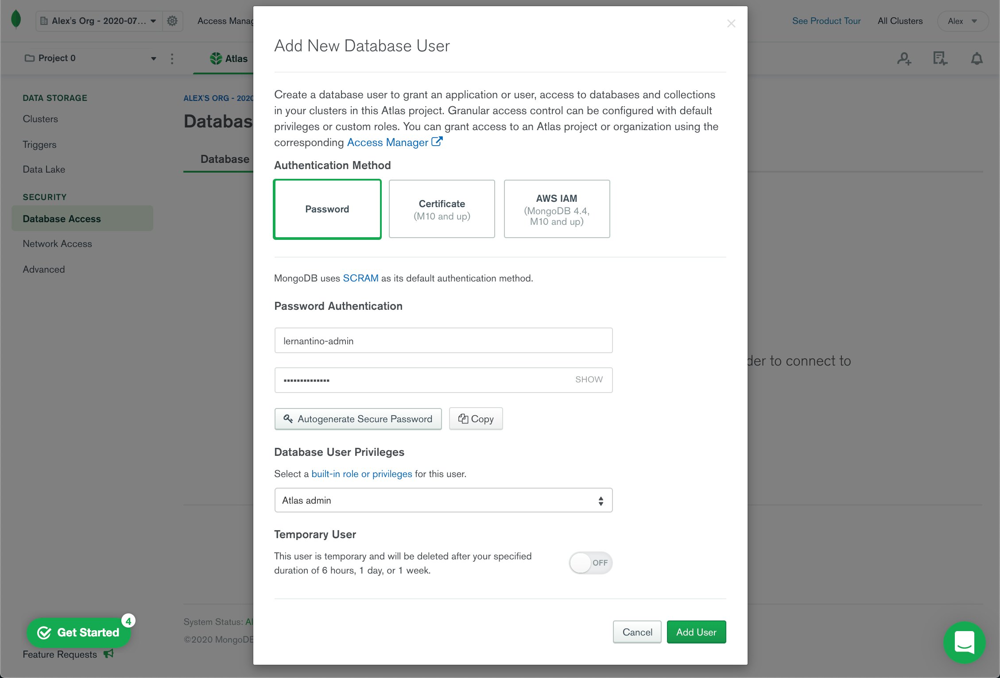
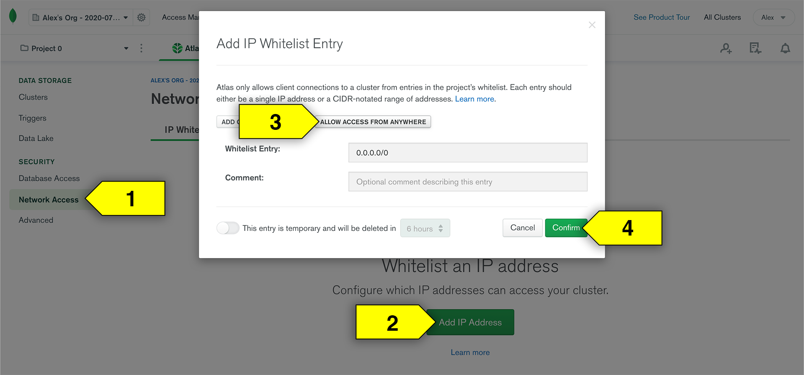

# Set Up with Mongo Atlas

In this guide, we will walk through the steps required to create your account and first cluster with MongoDB Atlas.

## What is MongoDB Atlas

MongoDB Atlas is a cloud-based database service created and maintained by MongoDB. It works with hosting services such as AWS, Azure, and Google Cloud to help users provision, maintain, and secure new databases for their applications.

We'll use its free service tier to host our MongoDB databases for our production-ready apps when we deploy them. Learn more about it at the [MongoDB Atlas site.](https://www.mongodb.com/cloud/atlas)

## Set Up Account and First Cluster

* To begin your sign up process, navigate to the [MongoDB Atlas sign up page,](https://www.mongodb.com/cloud/atlas/signup) which should look like this image:

  

* Fill out all of the required fields in the form and choose "I'm learning MongoDB" for the "How are you using MongoDB?" dropdown. When you're done, select the "Get started free" button to be brought to a page to choose your path and price tier.

### Choose a Path

* The next page looks something like this image:

  

* From this page, select the "Shared Cluster" plan on the left by clicking the "Create a cluster" button. This will begin the process of creating your first MongoDB Atlas cluster, which is simply a server that allows you to create and maintain multiple MongoDB databases.

* Upon selection of the "Shared Cluster" plan you should be taken to another page to create your starter cluster. 

### Create a Starter Cluster

* When you select the "Shared Cluster" tier, you should see a screen to create your starter cluster, resembling this image:

  

* On this page, you're prompted to pick a service provider and where you'd like the cluster to be hosted. Since it's free, the options don't matter too much, but it's easiest to just pick Amazon Web Services (AWS) as the provider and whatever recommended region is closest to you.

* Feel free to skip the "Cluster Tier" and "Additional Settings" options, as they don't pertain to our work unless you want a paid plan.

* Lower on this page, you have the option to name your cluster as well. If you leave it as is, it will be given a generic name like "Cluster0", but you may choose to provide it with your own name as well.

* Once you've picked all of your settings for this cluster, select the "Create Cluster" button in the lower right hand side of the page and you'll be brought to your Mongo Atlas dashboard.

### Set Up Your MongoDB Atlas Dashboard

* Since this is the first time you'll have seen this dashboard, you will be guided through steps to get started. Let's go through it here as well.

* **Create a Cluster:** You've done this already in the previous step, so we're all set here!

* **Add New Database User:** On the left-hand navigation menu, select the "Database Access" link underneath the "Security" header. The page should look like this image, where you can fill out the form as directed: 

  

  * To fill out the form:

    * Use "Password" option as authentication method
  
    * Create a username that you'll remember.
  
    * Create a password that you'll remember.

    * Select "Atlas Admin" as Database User Privilege.

    * Do not select "temporary user" unless you want to make a new user every so often.
  
    * Click "Add User" to complete this process.

* **Allow Your IP Address:** On the left-hand navigation menu, select the "Network Access" link underneath the "Security" header. Once there, follow these steps:

  * Click "Add IP Address" to open up a modal that looks like this image:

    

  * To make your database accessible from anywhere, click the button for "Allow Access From Anywhere" so it fills in the "Whitelist Entry:" value to `0.0.0.0/0`.

  * Click "Confirm" to finalize this process.

* That's it for now! We don't need to worry about adding sample data or connecting just yet. 

* Now that we're all set up with our accounts, let's create a [production-ready database for deployment!](./MongoAtlas-Deploy.md)
