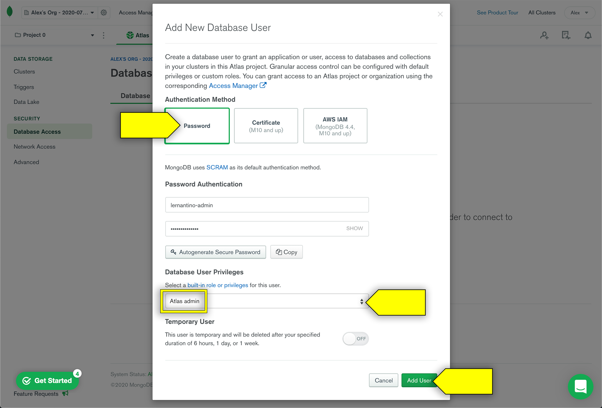
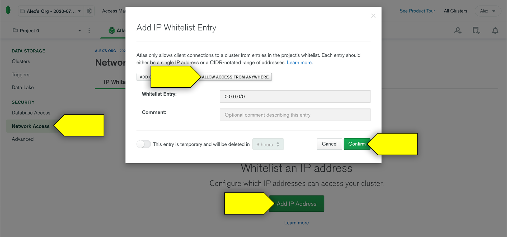

# Set Up MongoDB Atlas

In this guide, we will walk through the steps required to create your account and first cluster with MongoDB Atlas.

## What Is MongoDB Atlas?

MongoDB Atlas is a cloud-based database service that is created and maintained by MongoDB. It works with hosting services such as AWS, Azure, and Google Cloud to help users provision, maintain, and secure new databases for their applications.

We'll use its free service tier to host MongoDB databases for our production-ready apps when we deploy them. Learn more about it at the [MongoDB Atlas website](https://www.mongodb.com/cloud/atlas).

## Set Up Account and First Cluster

To get started, you'll need a MongoDB Atlast account.

1. To begin the sign-up process, navigate to the [MongoDB Atlas sign-up page](https://www.mongodb.com/cloud/atlas/signup), which is shown in the following image:

   

* Fill out all of the required fields, In the "How are you using MongoDB?" dropdown, choose "I'm learning MongoDB". When you're done, click "Get started free".

### Choose a Path

Next, you'll chooose a path, which means you'll choose how your clusters are arranged and managed.

The next page should look something like the following image:

1. Select the "Shared Cluster" plan on the left by clicking its "Create a cluster" button. This will begin the process of creating your first MongoDB Atlas **cluster**, which is simply a server that allows you to create and maintain multiple MongoDB databases.

* Upon selection of the "Shared Cluster" plan, you should be taken to another page to create your starter cluster. 

### Create a Starter Cluster

Next, we'll create a starter cluster.

1. When you select the "Shared Cluster" tier, you should see a screen to create your starter cluster, resembling this image:

   

2. On this page, you're prompted to pick a service provider and where you'd like the cluster to be hosted. Because it's free, the options don't matter too much&mdash;it's easiest to just pick Amazon Web Services (AWS) as the provider and whatever recommended region is closest to you.

3. Feel free to skip the "Cluster Tier" and "Additional Settings" options, as they don't pertain to our work unless you want a paid plan.

4. Further down on this page, you have the option to name your cluster as well. If you leave it as is, it will be given a generic name like "Cluster0", but you can give it another name if you want.

5. Once you've chosen all of your settings for this cluster, select the "Create Cluster" button in the lower righthand side of the page. This will take you to the MongoDB Atlas dashboard.

### Set Up Your MongoDB Atlas Dashboard

Because this is the first time you'll have seen this dashboard, you'll be guided through the steps to get started. Let's go through it here as well.

1. **Create a Cluster**: You've already done this in the previous step, so we're all set here!

2. **Add New Database User**: On the lefthand navigation menu, under Security, select the "Database Access" link. The following modal will appear: 

   

3. To fill out the form, follow these steps:

   * Use the Password option as authentication method
  
   * Create a username that you'll remember.
  
   * Create a password that you'll remember.

   * Select "Atlas Admin" as Database User Privilege.

   * Do not select "temporary user" unless you want to make a new user every so often.
  
   * Click "Add User" to complete this process.

4. **Allow Your IP Address**: On the lefthand navigation menu, under Security, click the "Network Access" link. Once there, follow these steps:

   * Click "Add IP Address". The following modal will appear:

     

   * To make your database accessible from anywhere, click the "Allow Access From Anywhere" button so it fills in the "Whitelist Entry:" value to `0.0.0.0/0`.

   * Click Confirm to finalize this process.

That's it for now! We don't need to worry about adding sample data or connecting just yet. 

Now that we're all set up with our accounts, you can move on to creating a production-ready database for deployment! For instructions, see [Deploy MongoDB Atlas](./MongoAtlas-Deploy.md).
