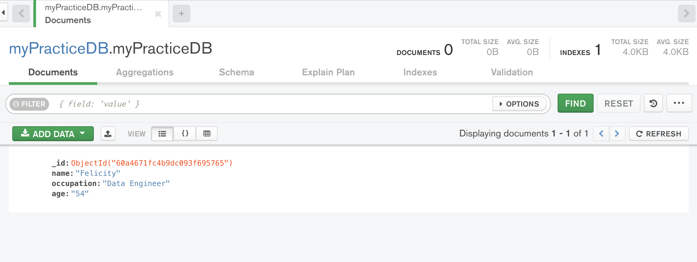

# 📖 Creating and Viewing Data With MongoDB Compass

Work with a partner to implement the following user story:

* As a developer, I want to create a MongoDB database to store data. 

* As a developer, I want to add a collection to my database and insert a document so that I can visually explore that data using MongoDB Compass. 

## Acceptance Criteria

* It's done when I click the `Connect` button to navigate to the Compass home page. 
> Note: You do not have to paste a connection string before clicking 'Connect`.

* It's done when I have created a new local database named `myPracticeDB` using Compass's Embedded MongoDB Shell (MongoSH Beta).

* It's done when I use the Embedded MongoDB Shell to add a new collection named `collection1` and insert a document into that collection that contains two fields: a name and an occupation. A value should be supplied for each field.

* It's done when I refresh the page and the `myPracticeDB` appears on the list of databases.

* It's done when I open the `collection1` collection and the document I just created is visible on the Documents tab and an `_id` field has been automatically inserted.

* It's done when I modify the existing document to have an additional field of `age` and the field is provided a value. 

## 📝 Notes

Refer to the documentation: 

[MongoDB Compass Docs on Connect to MongoDB](https://docs.mongodb.com/compass/current/connect/)

[MongoDB Compass Docs on Embedded MongoDB Shell](https://docs.mongodb.com/compass/current/embedded-shell/)

[MongoDB Docs on Creating a MongoDB Database with the CLI -- the MongoDB Shell](https://www.mongodb.com/basics/create-database)

[MongoDB Docs on MongoDB CRUD Operations](https://docs.mongodb.com/manual/crud/)

[MongoDB Compass Docs on Viewing Documents](https://docs.mongodb.com/compass/current/documents/view/)

[MongoDB Compass Docs on Modifying Documents](https://docs.mongodb.com/compass/current/documents/modify/)

## Assets

The following image demonstrates the web application's appearance and functionality:

---

## 💡 Hints

* What shell command do you use to create a new database? 

## 🏆 Bonus

If you have completed this activity, work through the following challenge with your partner to further your knowledge:

* How can you perform create, insert and delete operations in bulk using MongoDB? When would this be useful? 

Use [Google](https://www.google.com) or another search engine to research this.

---
© 2021 Trilogy Education Services, LLC, a 2U, Inc. brand. Confidential and Proprietary. All Rights Reserved.
