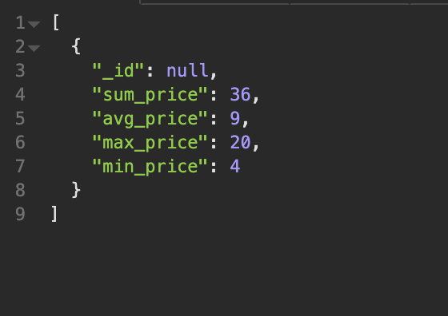

# 🐛 GET Route Returning Wrong Summary Price Data

Work with a partner to resolve the following issue(s):

*  As a user, I should be able to see summary statistics for the prices of items in stock. 

## Expected Behavior

When I test the `sum-price` GET route in Insomnia, summary statistics for only items that are in stock should be returned.

## Actual Behavior

When I test the `sum-price` GET route in Insomnia, summary statistics all items are returned.

## Steps to Reproduce the Problem

1. Run `npm install` and `node server` to start the app.

2. Navigate to Insomnia on your local machine and test the `sum-price` GET route.

3. The summary data for all items are being returned. To see a list of all items for comparison, use the `all-books` GET route. 

## Assets

The following image demonstrates the web application's appearance and functionality:

---

## 💡 Hints

What MongoDB aggregate pipeline stage do you use to filter data? 

## 🏆 Bonus

If you have completed this activity, work through the following challenge with your partner to further your knowledge:

* Aggregate middleware in one of four types of Mongoose middleware. What are the others and how are they used?

Use [Google](https://www.google.com) or another search engine to research this.

---
© 2021 Trilogy Education Services, LLC, a 2U, Inc. brand. Confidential and Proprietary. All Rights Reserved.
