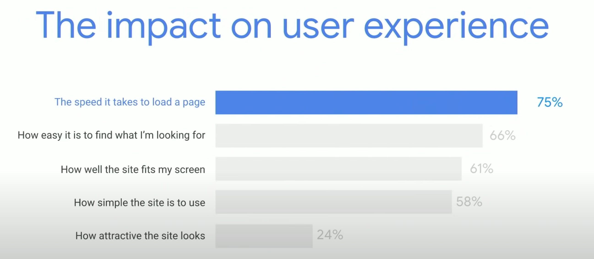

# Lighthouse Audits

* Lighthouse is an open-source, automated tool for improving the quality of web pages.

* With Lighthouse you can audit any web page for performance, accessibility, progressive web apps, SEO and more.

* 🔑 According to Google, the #1 reason a user will leave a website is due to slow loading time.

  

* You can run Lighthouse in Chrome DevTools, from the command line, or as a Node module. You give Lighthouse a URL to audit, it runs a series of audits against the page, and then it generates a report on how well the page did. 
  
* <Go to weather.com and run a Lighthouse audit in the DevTools, Generate Report.>

* From the audit, you can see the failing audits as indicators on how to improve the page. Each audit has a reference doc explaining why the audit is important, as well as how to fix it.

[Google Documentation on Lighthouse DevTools](https://developers.google.com/web/tools/lighthouse#devtools)

---
© 2021 Trilogy Education Services, LLC, a 2U, Inc. brand. Confidential and Proprietary. All Rights Reserved.
