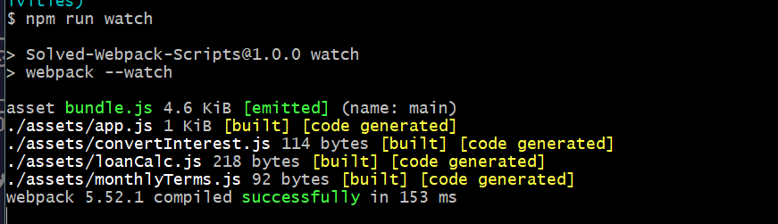

# 📖 Add NPM Scripts to Implementation of Webpack

Work with a partner to implement the following user story:

* As a developer, I want to bundle the JavaScript file from the command line.

* As a developer, I want to start webpack's Watch Mode from the command line.

## Acceptance Criteria

* It's done when a production ready bundle is created in the `dist/` folder from the command line using the command `npm run build`.
  
* It's done when Watch Mode is initiated from the command line using the command, `npm run watch`, as indicated in the following screenshot.

## 📝 Notes

Refer to the documentation: 

* [Webpack Docs on Watch mode](https://webpack.js.org/guides/development/#using-watch-mode)

* [Webpack Doc on NPM scripts](https://webpack.js.org/guides/getting-started/#npm-scripts)

## Assets

The following image demonstrates Watch mode is currently on:

---

## 🏆 Bonus

If you have completed this activity, work through the following challenge with your partner to further your knowledge:

* How can we implement Watch mode in production?

Use [Google](https://www.google.com) or another search engine to research this.

---
© 2021 Trilogy Education Services, LLC, a 2U, Inc. brand. Confidential and Proprietary. All Rights Reserved.
